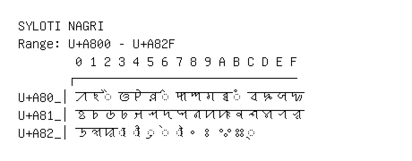

# Syloti Nagri

**Range:** `U+A800` - `U+A82F`

[← Back to Index](../README.md)

```text
        0 1 2 3 4 5 6 7 8 9 A B C D E F
       ┌───────────────────────────────
U+A80_│ꠀ ꠁ ◌ꠂ ꠃ ꠄ ꠅ ◌꠆ ꠇ ꠈ ꠉ ꠊ ◌ꠋ ꠌ ꠍ ꠎ ꠏ
U+A81_│ꠐ ꠑ ꠒ ꠓ ꠔ ꠕ ꠖ ꠗ ꠘ ꠙ ꠚ ꠛ ꠜ ꠝ ꠞ ꠟ
U+A82_│ꠠ ꠡ ꠢ ◌ꠣ ◌ꠤ ◌ꠥ ◌ꠦ ◌ꠧ ꠨ ꠩ ꠪ ꠫ ◌꠬
```

## Visual Fallback Reference
If your system lacks the required fonts to render these characters properly, use the image below as a visual guide.


