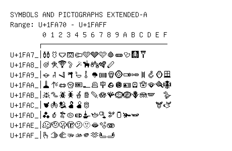

# Symbols and Pictographs Extended-A

**Range:** `U+1FA70` - `U+1FAFF`

[← Back to Index](../README.md)

```text
        0 1 2 3 4 5 6 7 8 9 A B C D E F
       ┌───────────────────────────────
U+1FA7_│🩰🩱🩲🩳🩴🩵🩶🩷🩸🩹🩺🩻🩼
U+1FA8_│🪀🪁🪂🪃🪄🪅🪆🪇🪈
U+1FA9_│🪐🪑🪒🪓🪔🪕🪖🪗🪘🪙🪚🪛🪜🪝🪞🪟
U+1FAA_│🪠🪡🪢🪣🪤🪥🪦🪧🪨🪩🪪🪫🪬🪭🪮🪯
U+1FAB_│🪰🪱🪲🪳🪴🪵🪶🪷🪸🪹🪺🪻🪼🪽  🪿
U+1FAC_│🫀🫁🫂🫃🫄🫅                🫎🫏
U+1FAD_│🫐🫑🫒🫓🫔🫕🫖🫗🫘🫙🫚🫛
U+1FAE_│🫠🫡🫢🫣🫤🫥🫦🫧🫨
U+1FAF_│🫰🫱🫲🫳🫴🫵🫶🫷🫸
```

## Visual Fallback Reference
If your system lacks the required fonts to render these characters properly, use the image below as a visual guide.


