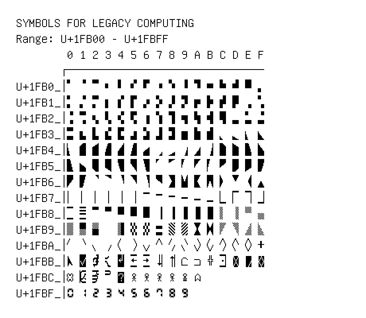

# Symbols for Legacy Computing

**Range:** `U+1FB00` - `U+1FBFF`

[← Back to Index](../README.md)

```text
        0 1 2 3 4 5 6 7 8 9 A B C D E F
       ┌───────────────────────────────
U+1FB0_│🬀 🬁 🬂 🬃 🬄 🬅 🬆 🬇 🬈 🬉 🬊 🬋 🬌 🬍 🬎 🬏
U+1FB1_│🬐 🬑 🬒 🬓 🬔 🬕 🬖 🬗 🬘 🬙 🬚 🬛 🬜 🬝 🬞 🬟
U+1FB2_│🬠 🬡 🬢 🬣 🬤 🬥 🬦 🬧 🬨 🬩 🬪 🬫 🬬 🬭 🬮 🬯
U+1FB3_│🬰 🬱 🬲 🬳 🬴 🬵 🬶 🬷 🬸 🬹 🬺 🬻 🬼 🬽 🬾 🬿
U+1FB4_│🭀 🭁 🭂 🭃 🭄 🭅 🭆 🭇 🭈 🭉 🭊 🭋 🭌 🭍 🭎 🭏
U+1FB5_│🭐 🭑 🭒 🭓 🭔 🭕 🭖 🭗 🭘 🭙 🭚 🭛 🭜 🭝 🭞 🭟
U+1FB6_│🭠 🭡 🭢 🭣 🭤 🭥 🭦 🭧 🭨 🭩 🭪 🭫 🭬 🭭 🭮 🭯
U+1FB7_│🭰 🭱 🭲 🭳 🭴 🭵 🭶 🭷 🭸 🭹 🭺 🭻 🭼 🭽 🭾 🭿
U+1FB8_│🮀 🮁 🮂 🮃 🮄 🮅 🮆 🮇 🮈 🮉 🮊 🮋 🮌 🮍 🮎 🮏
U+1FB9_│🮐 🮑 🮒   🮔 🮕 🮖 🮗 🮘 🮙 🮚 🮛 🮜 🮝 🮞 🮟
U+1FBA_│🮠 🮡 🮢 🮣 🮤 🮥 🮦 🮧 🮨 🮩 🮪 🮫 🮬 🮭 🮮 🮯
U+1FBB_│🮰 🮱 🮲 🮳 🮴 🮵 🮶 🮷 🮸 🮹 🮺 🮻 🮼 🮽 🮾 🮿
U+1FBC_│🯀 🯁 🯂 🯃 🯄 🯅 🯆 🯇 🯈 🯉 🯊
U+1FBF_│🯰 🯱 🯲 🯳 🯴 🯵 🯶 🯷 🯸 🯹
```

## Visual Fallback Reference
If your system lacks the required fonts to render these characters properly, use the image below as a visual guide.


