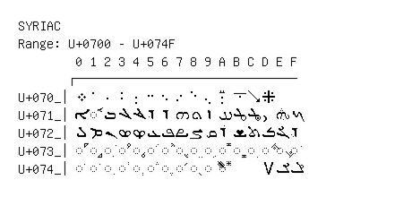

# Syriac

**Range:** `U+0700` - `U+074F`

[← Back to Index](../README.md)

```text
        0 1 2 3 4 5 6 7 8 9 A B C D E F
       ┌───────────────────────────────
U+070_│܀ ܁ ܂ ܃ ܄ ܅ ܆ ܇ ܈ ܉ ܊ ܋ ܌ ܍
U+071_│ܐ ◌ܑ ܒ ܓ ܔ ܕ ܖ ܗ ܘ ܙ ܚ ܛ ܜ ܝ ܞ ܟ
U+072_│ܠ ܡ ܢ ܣ ܤ ܥ ܦ ܧ ܨ ܩ ܪ ܫ ܬ ܭ ܮ ܯ
U+073_│◌ܰ ◌ܱ ◌ܲ ◌ܳ ◌ܴ ◌ܵ ◌ܶ ◌ܷ ◌ܸ ◌ܹ ◌ܺ ◌ܻ ◌ܼ ◌ܽ ◌ܾ ◌ܿ
U+074_│◌݀ ◌݁ ◌݂ ◌݃ ◌݄ ◌݅ ◌݆ ◌݇ ◌݈ ◌݉ ◌݊     ݍ ݎ ݏ
```

## Visual Fallback Reference
If your system lacks the required fonts to render these characters properly, use the image below as a visual guide.


