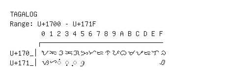

# Tagalog

**Range:** `U+1700` - `U+171F`

[← Back to Index](../README.md)

```text
        0 1 2 3 4 5 6 7 8 9 A B C D E F
       ┌───────────────────────────────
U+170_│ᜀ ᜁ ᜂ ᜃ ᜄ ᜅ ᜆ ᜇ ᜈ ᜉ ᜊ ᜋ ᜌ ᜍ ᜎ ᜏ
U+171_│ᜐ ᜑ ◌ᜒ ◌ᜓ ◌᜔ ◌᜕                   ᜟ
```

## Visual Fallback Reference
If your system lacks the required fonts to render these characters properly, use the image below as a visual guide.


