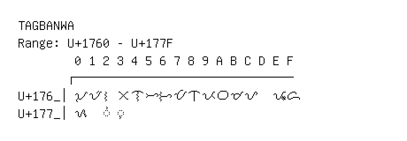

# Tagbanwa

**Range:** `U+1760` - `U+177F`

[← Back to Index](../README.md)

```text
        0 1 2 3 4 5 6 7 8 9 A B C D E F
       ┌───────────────────────────────
U+176_│ᝠ ᝡ ᝢ ᝣ ᝤ ᝥ ᝦ ᝧ ᝨ ᝩ ᝪ ᝫ ᝬ   ᝮ ᝯ
U+177_│ᝰ   ◌ᝲ ◌ᝳ
```

## Visual Fallback Reference
If your system lacks the required fonts to render these characters properly, use the image below as a visual guide.


