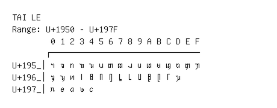

# Tai Le

**Range:** `U+1950` - `U+197F`

[← Back to Index](../README.md)

```text
        0 1 2 3 4 5 6 7 8 9 A B C D E F
       ┌───────────────────────────────
U+195_│ᥐ ᥑ ᥒ ᥓ ᥔ ᥕ ᥖ ᥗ ᥘ ᥙ ᥚ ᥛ ᥜ ᥝ ᥞ ᥟ
U+196_│ᥠ ᥡ ᥢ ᥣ ᥤ ᥥ ᥦ ᥧ ᥨ ᥩ ᥪ ᥫ ᥬ ᥭ
U+197_│ᥰ ᥱ ᥲ ᥳ ᥴ
```

## Visual Fallback Reference
If your system lacks the required fonts to render these characters properly, use the image below as a visual guide.


