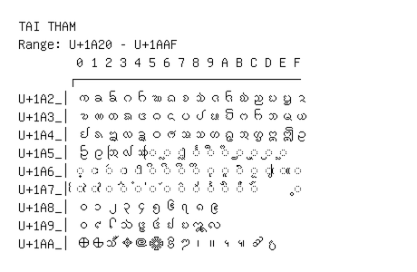

# Tai Tham

**Range:** `U+1A20` - `U+1AAF`

[← Back to Index](../README.md)

```text
        0 1 2 3 4 5 6 7 8 9 A B C D E F
       ┌───────────────────────────────
U+1A2_│ᨠ ᨡ ᨢ ᨣ ᨤ ᨥ ᨦ ᨧ ᨨ ᨩ ᨪ ᨫ ᨬ ᨭ ᨮ ᨯ
U+1A3_│ᨰ ᨱ ᨲ ᨳ ᨴ ᨵ ᨶ ᨷ ᨸ ᨹ ᨺ ᨻ ᨼ ᨽ ᨾ ᨿ
U+1A4_│ᩀ ᩁ ᩂ ᩃ ᩄ ᩅ ᩆ ᩇ ᩈ ᩉ ᩊ ᩋ ᩌ ᩍ ᩎ ᩏ
U+1A5_│ᩐ ᩑ ᩒ ᩓ ᩔ ◌ᩕ ◌ᩖ ◌ᩗ ◌ᩘ ◌ᩙ ◌ᩚ ◌ᩛ ◌ᩜ ◌ᩝ ◌ᩞ
U+1A6_│◌᩠ ◌ᩡ ◌ᩢ ◌ᩣ ◌ᩤ ◌ᩥ ◌ᩦ ◌ᩧ ◌ᩨ ◌ᩩ ◌ᩪ ◌ᩫ ◌ᩬ ◌ᩭ ◌ᩮ ◌ᩯ
U+1A7_│◌ᩰ ◌ᩱ ◌ᩲ ◌ᩳ ◌ᩴ ◌᩵ ◌᩶ ◌᩷ ◌᩸ ◌᩹ ◌᩺ ◌᩻ ◌᩼     ◌᩿
U+1A8_│᪀ ᪁ ᪂ ᪃ ᪄ ᪅ ᪆ ᪇ ᪈ ᪉
U+1A9_│᪐ ᪑ ᪒ ᪓ ᪔ ᪕ ᪖ ᪗ ᪘ ᪙
U+1AA_│᪠ ᪡ ᪢ ᪣ ᪤ ᪥ ᪦ ᪧ ᪨ ᪩ ᪪ ᪫ ᪬ ᪭
```

## Visual Fallback Reference
If your system lacks the required fonts to render these characters properly, use the image below as a visual guide.


