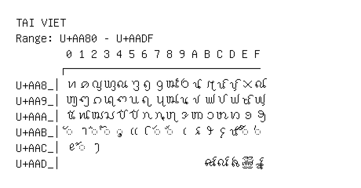

# Tai Viet

**Range:** `U+AA80` - `U+AADF`

[← Back to Index](../README.md)

```text
        0 1 2 3 4 5 6 7 8 9 A B C D E F
       ┌───────────────────────────────
U+AA8_│ꪀ ꪁ ꪂ ꪃ ꪄ ꪅ ꪆ ꪇ ꪈ ꪉ ꪊ ꪋ ꪌ ꪍ ꪎ ꪏ
U+AA9_│ꪐ ꪑ ꪒ ꪓ ꪔ ꪕ ꪖ ꪗ ꪘ ꪙ ꪚ ꪛ ꪜ ꪝ ꪞ ꪟ
U+AAA_│ꪠ ꪡ ꪢ ꪣ ꪤ ꪥ ꪦ ꪧ ꪨ ꪩ ꪪ ꪫ ꪬ ꪭ ꪮ ꪯ
U+AAB_│◌ꪰ ꪱ ◌ꪲ ◌ꪳ ◌ꪴ ꪵ ꪶ ◌ꪷ ◌ꪸ ꪹ ꪺ ꪻ ꪼ ꪽ ◌ꪾ ◌꪿
U+AAC_│ꫀ ◌꫁ ꫂ
U+AAD_│                      ꫛ ꫜ ꫝ ꫞ ꫟
```

## Visual Fallback Reference
If your system lacks the required fonts to render these characters properly, use the image below as a visual guide.


