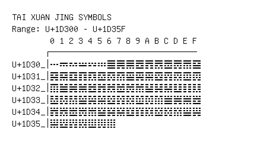

# Tai Xuan Jing Symbols

**Range:** `U+1D300` - `U+1D35F`

[← Back to Index](../README.md)

```text
        0 1 2 3 4 5 6 7 8 9 A B C D E F
       ┌───────────────────────────────
U+1D30_│𝌀 𝌁 𝌂 𝌃 𝌄 𝌅 𝌆 𝌇 𝌈 𝌉 𝌊 𝌋 𝌌 𝌍 𝌎 𝌏
U+1D31_│𝌐 𝌑 𝌒 𝌓 𝌔 𝌕 𝌖 𝌗 𝌘 𝌙 𝌚 𝌛 𝌜 𝌝 𝌞 𝌟
U+1D32_│𝌠 𝌡 𝌢 𝌣 𝌤 𝌥 𝌦 𝌧 𝌨 𝌩 𝌪 𝌫 𝌬 𝌭 𝌮 𝌯
U+1D33_│𝌰 𝌱 𝌲 𝌳 𝌴 𝌵 𝌶 𝌷 𝌸 𝌹 𝌺 𝌻 𝌼 𝌽 𝌾 𝌿
U+1D34_│𝍀 𝍁 𝍂 𝍃 𝍄 𝍅 𝍆 𝍇 𝍈 𝍉 𝍊 𝍋 𝍌 𝍍 𝍎 𝍏
U+1D35_│𝍐 𝍑 𝍒 𝍓 𝍔 𝍕 𝍖
```

## Visual Fallback Reference
If your system lacks the required fonts to render these characters properly, use the image below as a visual guide.


