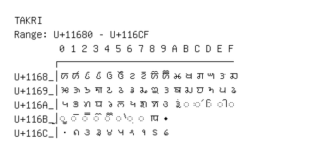

# Takri

**Range:** `U+11680` - `U+116CF`

[← Back to Index](../README.md)

```text
        0 1 2 3 4 5 6 7 8 9 A B C D E F
       ┌───────────────────────────────
U+1168_│𑚀 𑚁 𑚂 𑚃 𑚄 𑚅 𑚆 𑚇 𑚈 𑚉 𑚊 𑚋 𑚌 𑚍 𑚎 𑚏
U+1169_│𑚐 𑚑 𑚒 𑚓 𑚔 𑚕 𑚖 𑚗 𑚘 𑚙 𑚚 𑚛 𑚜 𑚝 𑚞 𑚟
U+116A_│𑚠 𑚡 𑚢 𑚣 𑚤 𑚥 𑚦 𑚧 𑚨 𑚩 𑚪 ◌𑚫 ◌𑚬 ◌𑚭 ◌𑚮 ◌𑚯
U+116B_│◌𑚰 ◌𑚱 ◌𑚲 ◌𑚳 ◌𑚴 ◌𑚵 ◌𑚶 ◌𑚷 𑚸 𑚹
U+116C_│𑛀 𑛁 𑛂 𑛃 𑛄 𑛅 𑛆 𑛇 𑛈 𑛉
```

## Visual Fallback Reference
If your system lacks the required fonts to render these characters properly, use the image below as a visual guide.


