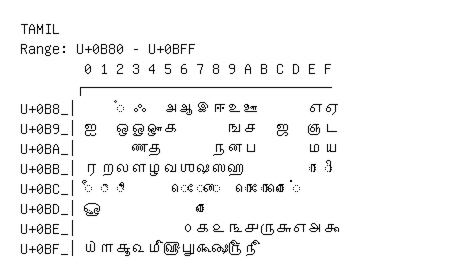

# Tamil

**Range:** `U+0B80` - `U+0BFF`

[← Back to Index](../README.md)

```text
        0 1 2 3 4 5 6 7 8 9 A B C D E F
       ┌───────────────────────────────
U+0B8_│    ◌ஂ ஃ   அ ஆ இ ஈ உ ஊ       எ ஏ
U+0B9_│ஐ   ஒ ஓ ஔ க       ங ச   ஜ   ஞ ட
U+0BA_│      ண த       ந ன ப       ம ய
U+0BB_│ர ற ல ள ழ வ ஶ ஷ ஸ ஹ         ◌ா ◌ி
U+0BC_│◌ீ ◌ு ◌ூ       ◌ெ ◌ே ◌ை   ◌ொ ◌ோ ◌ௌ ◌்
U+0BD_│ௐ             ◌ௗ
U+0BE_│            ௦ ௧ ௨ ௩ ௪ ௫ ௬ ௭ ௮ ௯
U+0BF_│௰ ௱ ௲ ௳ ௴ ௵ ௶ ௷ ௸ ௹ ௺
```

## Visual Fallback Reference
If your system lacks the required fonts to render these characters properly, use the image below as a visual guide.


