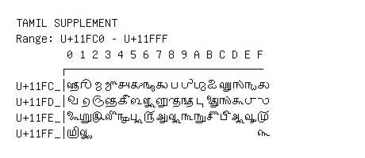

# Tamil Supplement

**Range:** `U+11FC0` - `U+11FFF`

[← Back to Index](../README.md)

```text
        0 1 2 3 4 5 6 7 8 9 A B C D E F
       ┌───────────────────────────────
U+11FC_│𑿀 𑿁 𑿂 𑿃 𑿄 𑿅 𑿆 𑿇 𑿈 𑿉 𑿊 𑿋 𑿌 𑿍 𑿎 𑿏
U+11FD_│𑿐 𑿑 𑿒 𑿓 𑿔 𑿕 𑿖 𑿗 𑿘 𑿙 𑿚 𑿛 𑿜 𑿝 𑿞 𑿟
U+11FE_│𑿠 𑿡 𑿢 𑿣 𑿤 𑿥 𑿦 𑿧 𑿨 𑿩 𑿪 𑿫 𑿬 𑿭 𑿮 𑿯
U+11FF_│𑿰 𑿱                           𑿿
```

## Visual Fallback Reference
If your system lacks the required fonts to render these characters properly, use the image below as a visual guide.


