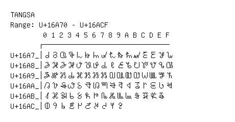

# Tangsa

**Range:** `U+16A70` - `U+16ACF`

[← Back to Index](../README.md)

```text
        0 1 2 3 4 5 6 7 8 9 A B C D E F
       ┌───────────────────────────────
U+16A7_│𖩰 𖩱 𖩲 𖩳 𖩴 𖩵 𖩶 𖩷 𖩸 𖩹 𖩺 𖩻 𖩼 𖩽 𖩾 𖩿
U+16A8_│𖪀 𖪁 𖪂 𖪃 𖪄 𖪅 𖪆 𖪇 𖪈 𖪉 𖪊 𖪋 𖪌 𖪍 𖪎 𖪏
U+16A9_│𖪐 𖪑 𖪒 𖪓 𖪔 𖪕 𖪖 𖪗 𖪘 𖪙 𖪚 𖪛 𖪜 𖪝 𖪞 𖪟
U+16AA_│𖪠 𖪡 𖪢 𖪣 𖪤 𖪥 𖪦 𖪧 𖪨 𖪩 𖪪 𖪫 𖪬 𖪭 𖪮 𖪯
U+16AB_│𖪰 𖪱 𖪲 𖪳 𖪴 𖪵 𖪶 𖪷 𖪸 𖪹 𖪺 𖪻 𖪼 𖪽 𖪾
U+16AC_│𖫀 𖫁 𖫂 𖫃 𖫄 𖫅 𖫆 𖫇 𖫈 𖫉
```

## Visual Fallback Reference
If your system lacks the required fonts to render these characters properly, use the image below as a visual guide.


