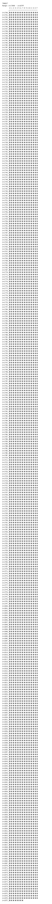

# Tangut

**Range:** `U+17000` - `U+187FF`

[← Back to Index](../README.md)

```text
        0 1 2 3 4 5 6 7 8 9 A B C D E F
       ┌───────────────────────────────
U+1700_│𗀀𗀁𗀂𗀃𗀄𗀅𗀆𗀇𗀈𗀉𗀊𗀋𗀌𗀍𗀎𗀏
U+1701_│𗀐𗀑𗀒𗀓𗀔𗀕𗀖𗀗𗀘𗀙𗀚𗀛𗀜𗀝𗀞𗀟
U+1702_│𗀠𗀡𗀢𗀣𗀤𗀥𗀦𗀧𗀨𗀩𗀪𗀫𗀬𗀭𗀮𗀯
U+1703_│𗀰𗀱𗀲𗀳𗀴𗀵𗀶𗀷𗀸𗀹𗀺𗀻𗀼𗀽𗀾𗀿
U+1704_│𗁀𗁁𗁂𗁃𗁄𗁅𗁆𗁇𗁈𗁉𗁊𗁋𗁌𗁍𗁎𗁏
U+1705_│𗁐𗁑𗁒𗁓𗁔𗁕𗁖𗁗𗁘𗁙𗁚𗁛𗁜𗁝𗁞𗁟
U+1706_│𗁠𗁡𗁢𗁣𗁤𗁥𗁦𗁧𗁨𗁩𗁪𗁫𗁬𗁭𗁮𗁯
U+1707_│𗁰𗁱𗁲𗁳𗁴𗁵𗁶𗁷𗁸𗁹𗁺𗁻𗁼𗁽𗁾𗁿
U+1708_│𗂀𗂁𗂂𗂃𗂄𗂅𗂆𗂇𗂈𗂉𗂊𗂋𗂌𗂍𗂎𗂏
U+1709_│𗂐𗂑𗂒𗂓𗂔𗂕𗂖𗂗𗂘𗂙𗂚𗂛𗂜𗂝𗂞𗂟
U+170A_│𗂠𗂡𗂢𗂣𗂤𗂥𗂦𗂧𗂨𗂩𗂪𗂫𗂬𗂭𗂮𗂯
U+170B_│𗂰𗂱𗂲𗂳𗂴𗂵𗂶𗂷𗂸𗂹𗂺𗂻𗂼𗂽𗂾𗂿
U+170C_│𗃀𗃁𗃂𗃃𗃄𗃅𗃆𗃇𗃈𗃉𗃊𗃋𗃌𗃍𗃎𗃏
U+170D_│𗃐𗃑𗃒𗃓𗃔𗃕𗃖𗃗𗃘𗃙𗃚𗃛𗃜𗃝𗃞𗃟
U+170E_│𗃠𗃡𗃢𗃣𗃤𗃥𗃦𗃧𗃨𗃩𗃪𗃫𗃬𗃭𗃮𗃯
U+170F_│𗃰𗃱𗃲𗃳𗃴𗃵𗃶𗃷𗃸𗃹𗃺𗃻𗃼𗃽𗃾𗃿
U+1710_│𗄀𗄁𗄂𗄃𗄄𗄅𗄆𗄇𗄈𗄉𗄊𗄋𗄌𗄍𗄎𗄏
U+1711_│𗄐𗄑𗄒𗄓𗄔𗄕𗄖𗄗𗄘𗄙𗄚𗄛𗄜𗄝𗄞𗄟
U+1712_│𗄠𗄡𗄢𗄣𗄤𗄥𗄦𗄧𗄨𗄩𗄪𗄫𗄬𗄭𗄮𗄯
U+1713_│𗄰𗄱𗄲𗄳𗄴𗄵𗄶𗄷𗄸𗄹𗄺𗄻𗄼𗄽𗄾𗄿
U+1714_│𗅀𗅁𗅂𗅃𗅄𗅅𗅆𗅇𗅈𗅉𗅊𗅋𗅌𗅍𗅎𗅏
U+1715_│𗅐𗅑𗅒𗅓𗅔𗅕𗅖𗅗𗅘𗅙𗅚𗅛𗅜𗅝𗅞𗅟
U+1716_│𗅠𗅡𗅢𗅣𗅤𗅥𗅦𗅧𗅨𗅩𗅪𗅫𗅬𗅭𗅮𗅯
U+1717_│𗅰𗅱𗅲𗅳𗅴𗅵𗅶𗅷𗅸𗅹𗅺𗅻𗅼𗅽𗅾𗅿
U+1718_│𗆀𗆁𗆂𗆃𗆄𗆅𗆆𗆇𗆈𗆉𗆊𗆋𗆌𗆍𗆎𗆏
U+1719_│𗆐𗆑𗆒𗆓𗆔𗆕𗆖𗆗𗆘𗆙𗆚𗆛𗆜𗆝𗆞𗆟
U+171A_│𗆠𗆡𗆢𗆣𗆤𗆥𗆦𗆧𗆨𗆩𗆪𗆫𗆬𗆭𗆮𗆯
U+171B_│𗆰𗆱𗆲𗆳𗆴𗆵𗆶𗆷𗆸𗆹𗆺𗆻𗆼𗆽𗆾𗆿
U+171C_│𗇀𗇁𗇂𗇃𗇄𗇅𗇆𗇇𗇈𗇉𗇊𗇋𗇌𗇍𗇎𗇏
U+171D_│𗇐𗇑𗇒𗇓𗇔𗇕𗇖𗇗𗇘𗇙𗇚𗇛𗇜𗇝𗇞𗇟
U+171E_│𗇠𗇡𗇢𗇣𗇤𗇥𗇦𗇧𗇨𗇩𗇪𗇫𗇬𗇭𗇮𗇯
U+171F_│𗇰𗇱𗇲𗇳𗇴𗇵𗇶𗇷𗇸𗇹𗇺𗇻𗇼𗇽𗇾𗇿
U+1720_│𗈀𗈁𗈂𗈃𗈄𗈅𗈆𗈇𗈈𗈉𗈊𗈋𗈌𗈍𗈎𗈏
U+1721_│𗈐𗈑𗈒𗈓𗈔𗈕𗈖𗈗𗈘𗈙𗈚𗈛𗈜𗈝𗈞𗈟
U+1722_│𗈠𗈡𗈢𗈣𗈤𗈥𗈦𗈧𗈨𗈩𗈪𗈫𗈬𗈭𗈮𗈯
U+1723_│𗈰𗈱𗈲𗈳𗈴𗈵𗈶𗈷𗈸𗈹𗈺𗈻𗈼𗈽𗈾𗈿
U+1724_│𗉀𗉁𗉂𗉃𗉄𗉅𗉆𗉇𗉈𗉉𗉊𗉋𗉌𗉍𗉎𗉏
U+1725_│𗉐𗉑𗉒𗉓𗉔𗉕𗉖𗉗𗉘𗉙𗉚𗉛𗉜𗉝𗉞𗉟
U+1726_│𗉠𗉡𗉢𗉣𗉤𗉥𗉦𗉧𗉨𗉩𗉪𗉫𗉬𗉭𗉮𗉯
U+1727_│𗉰𗉱𗉲𗉳𗉴𗉵𗉶𗉷𗉸𗉹𗉺𗉻𗉼𗉽𗉾𗉿
U+1728_│𗊀𗊁𗊂𗊃𗊄𗊅𗊆𗊇𗊈𗊉𗊊𗊋𗊌𗊍𗊎𗊏
U+1729_│𗊐𗊑𗊒𗊓𗊔𗊕𗊖𗊗𗊘𗊙𗊚𗊛𗊜𗊝𗊞𗊟
U+172A_│𗊠𗊡𗊢𗊣𗊤𗊥𗊦𗊧𗊨𗊩𗊪𗊫𗊬𗊭𗊮𗊯
U+172B_│𗊰𗊱𗊲𗊳𗊴𗊵𗊶𗊷𗊸𗊹𗊺𗊻𗊼𗊽𗊾𗊿
U+172C_│𗋀𗋁𗋂𗋃𗋄𗋅𗋆𗋇𗋈𗋉𗋊𗋋𗋌𗋍𗋎𗋏
U+172D_│𗋐𗋑𗋒𗋓𗋔𗋕𗋖𗋗𗋘𗋙𗋚𗋛𗋜𗋝𗋞𗋟
U+172E_│𗋠𗋡𗋢𗋣𗋤𗋥𗋦𗋧𗋨𗋩𗋪𗋫𗋬𗋭𗋮𗋯
U+172F_│𗋰𗋱𗋲𗋳𗋴𗋵𗋶𗋷𗋸𗋹𗋺𗋻𗋼𗋽𗋾𗋿
U+1730_│𗌀𗌁𗌂𗌃𗌄𗌅𗌆𗌇𗌈𗌉𗌊𗌋𗌌𗌍𗌎𗌏
U+1731_│𗌐𗌑𗌒𗌓𗌔𗌕𗌖𗌗𗌘𗌙𗌚𗌛𗌜𗌝𗌞𗌟
U+1732_│𗌠𗌡𗌢𗌣𗌤𗌥𗌦𗌧𗌨𗌩𗌪𗌫𗌬𗌭𗌮𗌯
U+1733_│𗌰𗌱𗌲𗌳𗌴𗌵𗌶𗌷𗌸𗌹𗌺𗌻𗌼𗌽𗌾𗌿
U+1734_│𗍀𗍁𗍂𗍃𗍄𗍅𗍆𗍇𗍈𗍉𗍊𗍋𗍌𗍍𗍎𗍏
U+1735_│𗍐𗍑𗍒𗍓𗍔𗍕𗍖𗍗𗍘𗍙𗍚𗍛𗍜𗍝𗍞𗍟
U+1736_│𗍠𗍡𗍢𗍣𗍤𗍥𗍦𗍧𗍨𗍩𗍪𗍫𗍬𗍭𗍮𗍯
U+1737_│𗍰𗍱𗍲𗍳𗍴𗍵𗍶𗍷𗍸𗍹𗍺𗍻𗍼𗍽𗍾𗍿
U+1738_│𗎀𗎁𗎂𗎃𗎄𗎅𗎆𗎇𗎈𗎉𗎊𗎋𗎌𗎍𗎎𗎏
U+1739_│𗎐𗎑𗎒𗎓𗎔𗎕𗎖𗎗𗎘𗎙𗎚𗎛𗎜𗎝𗎞𗎟
U+173A_│𗎠𗎡𗎢𗎣𗎤𗎥𗎦𗎧𗎨𗎩𗎪𗎫𗎬𗎭𗎮𗎯
U+173B_│𗎰𗎱𗎲𗎳𗎴𗎵𗎶𗎷𗎸𗎹𗎺𗎻𗎼𗎽𗎾𗎿
U+173C_│𗏀𗏁𗏂𗏃𗏄𗏅𗏆𗏇𗏈𗏉𗏊𗏋𗏌𗏍𗏎𗏏
U+173D_│𗏐𗏑𗏒𗏓𗏔𗏕𗏖𗏗𗏘𗏙𗏚𗏛𗏜𗏝𗏞𗏟
U+173E_│𗏠𗏡𗏢𗏣𗏤𗏥𗏦𗏧𗏨𗏩𗏪𗏫𗏬𗏭𗏮𗏯
U+173F_│𗏰𗏱𗏲𗏳𗏴𗏵𗏶𗏷𗏸𗏹𗏺𗏻𗏼𗏽𗏾𗏿
U+1740_│𗐀𗐁𗐂𗐃𗐄𗐅𗐆𗐇𗐈𗐉𗐊𗐋𗐌𗐍𗐎𗐏
U+1741_│𗐐𗐑𗐒𗐓𗐔𗐕𗐖𗐗𗐘𗐙𗐚𗐛𗐜𗐝𗐞𗐟
U+1742_│𗐠𗐡𗐢𗐣𗐤𗐥𗐦𗐧𗐨𗐩𗐪𗐫𗐬𗐭𗐮𗐯
U+1743_│𗐰𗐱𗐲𗐳𗐴𗐵𗐶𗐷𗐸𗐹𗐺𗐻𗐼𗐽𗐾𗐿
U+1744_│𗑀𗑁𗑂𗑃𗑄𗑅𗑆𗑇𗑈𗑉𗑊𗑋𗑌𗑍𗑎𗑏
U+1745_│𗑐𗑑𗑒𗑓𗑔𗑕𗑖𗑗𗑘𗑙𗑚𗑛𗑜𗑝𗑞𗑟
U+1746_│𗑠𗑡𗑢𗑣𗑤𗑥𗑦𗑧𗑨𗑩𗑪𗑫𗑬𗑭𗑮𗑯
U+1747_│𗑰𗑱𗑲𗑳𗑴𗑵𗑶𗑷𗑸𗑹𗑺𗑻𗑼𗑽𗑾𗑿
U+1748_│𗒀𗒁𗒂𗒃𗒄𗒅𗒆𗒇𗒈𗒉𗒊𗒋𗒌𗒍𗒎𗒏
U+1749_│𗒐𗒑𗒒𗒓𗒔𗒕𗒖𗒗𗒘𗒙𗒚𗒛𗒜𗒝𗒞𗒟
U+174A_│𗒠𗒡𗒢𗒣𗒤𗒥𗒦𗒧𗒨𗒩𗒪𗒫𗒬𗒭𗒮𗒯
U+174B_│𗒰𗒱𗒲𗒳𗒴𗒵𗒶𗒷𗒸𗒹𗒺𗒻𗒼𗒽𗒾𗒿
U+174C_│𗓀𗓁𗓂𗓃𗓄𗓅𗓆𗓇𗓈𗓉𗓊𗓋𗓌𗓍𗓎𗓏
U+174D_│𗓐𗓑𗓒𗓓𗓔𗓕𗓖𗓗𗓘𗓙𗓚𗓛𗓜𗓝𗓞𗓟
U+174E_│𗓠𗓡𗓢𗓣𗓤𗓥𗓦𗓧𗓨𗓩𗓪𗓫𗓬𗓭𗓮𗓯
U+174F_│𗓰𗓱𗓲𗓳𗓴𗓵𗓶𗓷𗓸𗓹𗓺𗓻𗓼𗓽𗓾𗓿
U+1750_│𗔀𗔁𗔂𗔃𗔄𗔅𗔆𗔇𗔈𗔉𗔊𗔋𗔌𗔍𗔎𗔏
U+1751_│𗔐𗔑𗔒𗔓𗔔𗔕𗔖𗔗𗔘𗔙𗔚𗔛𗔜𗔝𗔞𗔟
U+1752_│𗔠𗔡𗔢𗔣𗔤𗔥𗔦𗔧𗔨𗔩𗔪𗔫𗔬𗔭𗔮𗔯
U+1753_│𗔰𗔱𗔲𗔳𗔴𗔵𗔶𗔷𗔸𗔹𗔺𗔻𗔼𗔽𗔾𗔿
U+1754_│𗕀𗕁𗕂𗕃𗕄𗕅𗕆𗕇𗕈𗕉𗕊𗕋𗕌𗕍𗕎𗕏
U+1755_│𗕐𗕑𗕒𗕓𗕔𗕕𗕖𗕗𗕘𗕙𗕚𗕛𗕜𗕝𗕞𗕟
U+1756_│𗕠𗕡𗕢𗕣𗕤𗕥𗕦𗕧𗕨𗕩𗕪𗕫𗕬𗕭𗕮𗕯
U+1757_│𗕰𗕱𗕲𗕳𗕴𗕵𗕶𗕷𗕸𗕹𗕺𗕻𗕼𗕽𗕾𗕿
U+1758_│𗖀𗖁𗖂𗖃𗖄𗖅𗖆𗖇𗖈𗖉𗖊𗖋𗖌𗖍𗖎𗖏
U+1759_│𗖐𗖑𗖒𗖓𗖔𗖕𗖖𗖗𗖘𗖙𗖚𗖛𗖜𗖝𗖞𗖟
U+175A_│𗖠𗖡𗖢𗖣𗖤𗖥𗖦𗖧𗖨𗖩𗖪𗖫𗖬𗖭𗖮𗖯
U+175B_│𗖰𗖱𗖲𗖳𗖴𗖵𗖶𗖷𗖸𗖹𗖺𗖻𗖼𗖽𗖾𗖿
U+175C_│𗗀𗗁𗗂𗗃𗗄𗗅𗗆𗗇𗗈𗗉𗗊𗗋𗗌𗗍𗗎𗗏
U+175D_│𗗐𗗑𗗒𗗓𗗔𗗕𗗖𗗗𗗘𗗙𗗚𗗛𗗜𗗝𗗞𗗟
U+175E_│𗗠𗗡𗗢𗗣𗗤𗗥𗗦𗗧𗗨𗗩𗗪𗗫𗗬𗗭𗗮𗗯
U+175F_│𗗰𗗱𗗲𗗳𗗴𗗵𗗶𗗷𗗸𗗹𗗺𗗻𗗼𗗽𗗾𗗿
U+1760_│𗘀𗘁𗘂𗘃𗘄𗘅𗘆𗘇𗘈𗘉𗘊𗘋𗘌𗘍𗘎𗘏
U+1761_│𗘐𗘑𗘒𗘓𗘔𗘕𗘖𗘗𗘘𗘙𗘚𗘛𗘜𗘝𗘞𗘟
U+1762_│𗘠𗘡𗘢𗘣𗘤𗘥𗘦𗘧𗘨𗘩𗘪𗘫𗘬𗘭𗘮𗘯
U+1763_│𗘰𗘱𗘲𗘳𗘴𗘵𗘶𗘷𗘸𗘹𗘺𗘻𗘼𗘽𗘾𗘿
U+1764_│𗙀𗙁𗙂𗙃𗙄𗙅𗙆𗙇𗙈𗙉𗙊𗙋𗙌𗙍𗙎𗙏
U+1765_│𗙐𗙑𗙒𗙓𗙔𗙕𗙖𗙗𗙘𗙙𗙚𗙛𗙜𗙝𗙞𗙟
U+1766_│𗙠𗙡𗙢𗙣𗙤𗙥𗙦𗙧𗙨𗙩𗙪𗙫𗙬𗙭𗙮𗙯
U+1767_│𗙰𗙱𗙲𗙳𗙴𗙵𗙶𗙷𗙸𗙹𗙺𗙻𗙼𗙽𗙾𗙿
U+1768_│𗚀𗚁𗚂𗚃𗚄𗚅𗚆𗚇𗚈𗚉𗚊𗚋𗚌𗚍𗚎𗚏
U+1769_│𗚐𗚑𗚒𗚓𗚔𗚕𗚖𗚗𗚘𗚙𗚚𗚛𗚜𗚝𗚞𗚟
U+176A_│𗚠𗚡𗚢𗚣𗚤𗚥𗚦𗚧𗚨𗚩𗚪𗚫𗚬𗚭𗚮𗚯
U+176B_│𗚰𗚱𗚲𗚳𗚴𗚵𗚶𗚷𗚸𗚹𗚺𗚻𗚼𗚽𗚾𗚿
U+176C_│𗛀𗛁𗛂𗛃𗛄𗛅𗛆𗛇𗛈𗛉𗛊𗛋𗛌𗛍𗛎𗛏
U+176D_│𗛐𗛑𗛒𗛓𗛔𗛕𗛖𗛗𗛘𗛙𗛚𗛛𗛜𗛝𗛞𗛟
U+176E_│𗛠𗛡𗛢𗛣𗛤𗛥𗛦𗛧𗛨𗛩𗛪𗛫𗛬𗛭𗛮𗛯
U+176F_│𗛰𗛱𗛲𗛳𗛴𗛵𗛶𗛷𗛸𗛹𗛺𗛻𗛼𗛽𗛾𗛿
U+1770_│𗜀𗜁𗜂𗜃𗜄𗜅𗜆𗜇𗜈𗜉𗜊𗜋𗜌𗜍𗜎𗜏
U+1771_│𗜐𗜑𗜒𗜓𗜔𗜕𗜖𗜗𗜘𗜙𗜚𗜛𗜜𗜝𗜞𗜟
U+1772_│𗜠𗜡𗜢𗜣𗜤𗜥𗜦𗜧𗜨𗜩𗜪𗜫𗜬𗜭𗜮𗜯
U+1773_│𗜰𗜱𗜲𗜳𗜴𗜵𗜶𗜷𗜸𗜹𗜺𗜻𗜼𗜽𗜾𗜿
U+1774_│𗝀𗝁𗝂𗝃𗝄𗝅𗝆𗝇𗝈𗝉𗝊𗝋𗝌𗝍𗝎𗝏
U+1775_│𗝐𗝑𗝒𗝓𗝔𗝕𗝖𗝗𗝘𗝙𗝚𗝛𗝜𗝝𗝞𗝟
U+1776_│𗝠𗝡𗝢𗝣𗝤𗝥𗝦𗝧𗝨𗝩𗝪𗝫𗝬𗝭𗝮𗝯
U+1777_│𗝰𗝱𗝲𗝳𗝴𗝵𗝶𗝷𗝸𗝹𗝺𗝻𗝼𗝽𗝾𗝿
U+1778_│𗞀𗞁𗞂𗞃𗞄𗞅𗞆𗞇𗞈𗞉𗞊𗞋𗞌𗞍𗞎𗞏
U+1779_│𗞐𗞑𗞒𗞓𗞔𗞕𗞖𗞗𗞘𗞙𗞚𗞛𗞜𗞝𗞞𗞟
U+177A_│𗞠𗞡𗞢𗞣𗞤𗞥𗞦𗞧𗞨𗞩𗞪𗞫𗞬𗞭𗞮𗞯
U+177B_│𗞰𗞱𗞲𗞳𗞴𗞵𗞶𗞷𗞸𗞹𗞺𗞻𗞼𗞽𗞾𗞿
U+177C_│𗟀𗟁𗟂𗟃𗟄𗟅𗟆𗟇𗟈𗟉𗟊𗟋𗟌𗟍𗟎𗟏
U+177D_│𗟐𗟑𗟒𗟓𗟔𗟕𗟖𗟗𗟘𗟙𗟚𗟛𗟜𗟝𗟞𗟟
U+177E_│𗟠𗟡𗟢𗟣𗟤𗟥𗟦𗟧𗟨𗟩𗟪𗟫𗟬𗟭𗟮𗟯
U+177F_│𗟰𗟱𗟲𗟳𗟴𗟵𗟶𗟷𗟸𗟹𗟺𗟻𗟼𗟽𗟾𗟿
U+1780_│𗠀𗠁𗠂𗠃𗠄𗠅𗠆𗠇𗠈𗠉𗠊𗠋𗠌𗠍𗠎𗠏
U+1781_│𗠐𗠑𗠒𗠓𗠔𗠕𗠖𗠗𗠘𗠙𗠚𗠛𗠜𗠝𗠞𗠟
U+1782_│𗠠𗠡𗠢𗠣𗠤𗠥𗠦𗠧𗠨𗠩𗠪𗠫𗠬𗠭𗠮𗠯
U+1783_│𗠰𗠱𗠲𗠳𗠴𗠵𗠶𗠷𗠸𗠹𗠺𗠻𗠼𗠽𗠾𗠿
U+1784_│𗡀𗡁𗡂𗡃𗡄𗡅𗡆𗡇𗡈𗡉𗡊𗡋𗡌𗡍𗡎𗡏
U+1785_│𗡐𗡑𗡒𗡓𗡔𗡕𗡖𗡗𗡘𗡙𗡚𗡛𗡜𗡝𗡞𗡟
U+1786_│𗡠𗡡𗡢𗡣𗡤𗡥𗡦𗡧𗡨𗡩𗡪𗡫𗡬𗡭𗡮𗡯
U+1787_│𗡰𗡱𗡲𗡳𗡴𗡵𗡶𗡷𗡸𗡹𗡺𗡻𗡼𗡽𗡾𗡿
U+1788_│𗢀𗢁𗢂𗢃𗢄𗢅𗢆𗢇𗢈𗢉𗢊𗢋𗢌𗢍𗢎𗢏
U+1789_│𗢐𗢑𗢒𗢓𗢔𗢕𗢖𗢗𗢘𗢙𗢚𗢛𗢜𗢝𗢞𗢟
U+178A_│𗢠𗢡𗢢𗢣𗢤𗢥𗢦𗢧𗢨𗢩𗢪𗢫𗢬𗢭𗢮𗢯
U+178B_│𗢰𗢱𗢲𗢳𗢴𗢵𗢶𗢷𗢸𗢹𗢺𗢻𗢼𗢽𗢾𗢿
U+178C_│𗣀𗣁𗣂𗣃𗣄𗣅𗣆𗣇𗣈𗣉𗣊𗣋𗣌𗣍𗣎𗣏
U+178D_│𗣐𗣑𗣒𗣓𗣔𗣕𗣖𗣗𗣘𗣙𗣚𗣛𗣜𗣝𗣞𗣟
U+178E_│𗣠𗣡𗣢𗣣𗣤𗣥𗣦𗣧𗣨𗣩𗣪𗣫𗣬𗣭𗣮𗣯
U+178F_│𗣰𗣱𗣲𗣳𗣴𗣵𗣶𗣷𗣸𗣹𗣺𗣻𗣼𗣽𗣾𗣿
U+1790_│𗤀𗤁𗤂𗤃𗤄𗤅𗤆𗤇𗤈𗤉𗤊𗤋𗤌𗤍𗤎𗤏
U+1791_│𗤐𗤑𗤒𗤓𗤔𗤕𗤖𗤗𗤘𗤙𗤚𗤛𗤜𗤝𗤞𗤟
U+1792_│𗤠𗤡𗤢𗤣𗤤𗤥𗤦𗤧𗤨𗤩𗤪𗤫𗤬𗤭𗤮𗤯
U+1793_│𗤰𗤱𗤲𗤳𗤴𗤵𗤶𗤷𗤸𗤹𗤺𗤻𗤼𗤽𗤾𗤿
U+1794_│𗥀𗥁𗥂𗥃𗥄𗥅𗥆𗥇𗥈𗥉𗥊𗥋𗥌𗥍𗥎𗥏
U+1795_│𗥐𗥑𗥒𗥓𗥔𗥕𗥖𗥗𗥘𗥙𗥚𗥛𗥜𗥝𗥞𗥟
U+1796_│𗥠𗥡𗥢𗥣𗥤𗥥𗥦𗥧𗥨𗥩𗥪𗥫𗥬𗥭𗥮𗥯
U+1797_│𗥰𗥱𗥲𗥳𗥴𗥵𗥶𗥷𗥸𗥹𗥺𗥻𗥼𗥽𗥾𗥿
U+1798_│𗦀𗦁𗦂𗦃𗦄𗦅𗦆𗦇𗦈𗦉𗦊𗦋𗦌𗦍𗦎𗦏
U+1799_│𗦐𗦑𗦒𗦓𗦔𗦕𗦖𗦗𗦘𗦙𗦚𗦛𗦜𗦝𗦞𗦟
U+179A_│𗦠𗦡𗦢𗦣𗦤𗦥𗦦𗦧𗦨𗦩𗦪𗦫𗦬𗦭𗦮𗦯
U+179B_│𗦰𗦱𗦲𗦳𗦴𗦵𗦶𗦷𗦸𗦹𗦺𗦻𗦼𗦽𗦾𗦿
U+179C_│𗧀𗧁𗧂𗧃𗧄𗧅𗧆𗧇𗧈𗧉𗧊𗧋𗧌𗧍𗧎𗧏
U+179D_│𗧐𗧑𗧒𗧓𗧔𗧕𗧖𗧗𗧘𗧙𗧚𗧛𗧜𗧝𗧞𗧟
U+179E_│𗧠𗧡𗧢𗧣𗧤𗧥𗧦𗧧𗧨𗧩𗧪𗧫𗧬𗧭𗧮𗧯
U+179F_│𗧰𗧱𗧲𗧳𗧴𗧵𗧶𗧷𗧸𗧹𗧺𗧻𗧼𗧽𗧾𗧿
U+17A0_│𗨀𗨁𗨂𗨃𗨄𗨅𗨆𗨇𗨈𗨉𗨊𗨋𗨌𗨍𗨎𗨏
U+17A1_│𗨐𗨑𗨒𗨓𗨔𗨕𗨖𗨗𗨘𗨙𗨚𗨛𗨜𗨝𗨞𗨟
U+17A2_│𗨠𗨡𗨢𗨣𗨤𗨥𗨦𗨧𗨨𗨩𗨪𗨫𗨬𗨭𗨮𗨯
U+17A3_│𗨰𗨱𗨲𗨳𗨴𗨵𗨶𗨷𗨸𗨹𗨺𗨻𗨼𗨽𗨾𗨿
U+17A4_│𗩀𗩁𗩂𗩃𗩄𗩅𗩆𗩇𗩈𗩉𗩊𗩋𗩌𗩍𗩎𗩏
U+17A5_│𗩐𗩑𗩒𗩓𗩔𗩕𗩖𗩗𗩘𗩙𗩚𗩛𗩜𗩝𗩞𗩟
U+17A6_│𗩠𗩡𗩢𗩣𗩤𗩥𗩦𗩧𗩨𗩩𗩪𗩫𗩬𗩭𗩮𗩯
U+17A7_│𗩰𗩱𗩲𗩳𗩴𗩵𗩶𗩷𗩸𗩹𗩺𗩻𗩼𗩽𗩾𗩿
U+17A8_│𗪀𗪁𗪂𗪃𗪄𗪅𗪆𗪇𗪈𗪉𗪊𗪋𗪌𗪍𗪎𗪏
U+17A9_│𗪐𗪑𗪒𗪓𗪔𗪕𗪖𗪗𗪘𗪙𗪚𗪛𗪜𗪝𗪞𗪟
U+17AA_│𗪠𗪡𗪢𗪣𗪤𗪥𗪦𗪧𗪨𗪩𗪪𗪫𗪬𗪭𗪮𗪯
U+17AB_│𗪰𗪱𗪲𗪳𗪴𗪵𗪶𗪷𗪸𗪹𗪺𗪻𗪼𗪽𗪾𗪿
U+17AC_│𗫀𗫁𗫂𗫃𗫄𗫅𗫆𗫇𗫈𗫉𗫊𗫋𗫌𗫍𗫎𗫏
U+17AD_│𗫐𗫑𗫒𗫓𗫔𗫕𗫖𗫗𗫘𗫙𗫚𗫛𗫜𗫝𗫞𗫟
U+17AE_│𗫠𗫡𗫢𗫣𗫤𗫥𗫦𗫧𗫨𗫩𗫪𗫫𗫬𗫭𗫮𗫯
U+17AF_│𗫰𗫱𗫲𗫳𗫴𗫵𗫶𗫷𗫸𗫹𗫺𗫻𗫼𗫽𗫾𗫿
U+17B0_│𗬀𗬁𗬂𗬃𗬄𗬅𗬆𗬇𗬈𗬉𗬊𗬋𗬌𗬍𗬎𗬏
U+17B1_│𗬐𗬑𗬒𗬓𗬔𗬕𗬖𗬗𗬘𗬙𗬚𗬛𗬜𗬝𗬞𗬟
U+17B2_│𗬠𗬡𗬢𗬣𗬤𗬥𗬦𗬧𗬨𗬩𗬪𗬫𗬬𗬭𗬮𗬯
U+17B3_│𗬰𗬱𗬲𗬳𗬴𗬵𗬶𗬷𗬸𗬹𗬺𗬻𗬼𗬽𗬾𗬿
U+17B4_│𗭀𗭁𗭂𗭃𗭄𗭅𗭆𗭇𗭈𗭉𗭊𗭋𗭌𗭍𗭎𗭏
U+17B5_│𗭐𗭑𗭒𗭓𗭔𗭕𗭖𗭗𗭘𗭙𗭚𗭛𗭜𗭝𗭞𗭟
U+17B6_│𗭠𗭡𗭢𗭣𗭤𗭥𗭦𗭧𗭨𗭩𗭪𗭫𗭬𗭭𗭮𗭯
U+17B7_│𗭰𗭱𗭲𗭳𗭴𗭵𗭶𗭷𗭸𗭹𗭺𗭻𗭼𗭽𗭾𗭿
U+17B8_│𗮀𗮁𗮂𗮃𗮄𗮅𗮆𗮇𗮈𗮉𗮊𗮋𗮌𗮍𗮎𗮏
U+17B9_│𗮐𗮑𗮒𗮓𗮔𗮕𗮖𗮗𗮘𗮙𗮚𗮛𗮜𗮝𗮞𗮟
U+17BA_│𗮠𗮡𗮢𗮣𗮤𗮥𗮦𗮧𗮨𗮩𗮪𗮫𗮬𗮭𗮮𗮯
U+17BB_│𗮰𗮱𗮲𗮳𗮴𗮵𗮶𗮷𗮸𗮹𗮺𗮻𗮼𗮽𗮾𗮿
U+17BC_│𗯀𗯁𗯂𗯃𗯄𗯅𗯆𗯇𗯈𗯉𗯊𗯋𗯌𗯍𗯎𗯏
U+17BD_│𗯐𗯑𗯒𗯓𗯔𗯕𗯖𗯗𗯘𗯙𗯚𗯛𗯜𗯝𗯞𗯟
U+17BE_│𗯠𗯡𗯢𗯣𗯤𗯥𗯦𗯧𗯨𗯩𗯪𗯫𗯬𗯭𗯮𗯯
U+17BF_│𗯰𗯱𗯲𗯳𗯴𗯵𗯶𗯷𗯸𗯹𗯺𗯻𗯼𗯽𗯾𗯿
U+17C0_│𗰀𗰁𗰂𗰃𗰄𗰅𗰆𗰇𗰈𗰉𗰊𗰋𗰌𗰍𗰎𗰏
U+17C1_│𗰐𗰑𗰒𗰓𗰔𗰕𗰖𗰗𗰘𗰙𗰚𗰛𗰜𗰝𗰞𗰟
U+17C2_│𗰠𗰡𗰢𗰣𗰤𗰥𗰦𗰧𗰨𗰩𗰪𗰫𗰬𗰭𗰮𗰯
U+17C3_│𗰰𗰱𗰲𗰳𗰴𗰵𗰶𗰷𗰸𗰹𗰺𗰻𗰼𗰽𗰾𗰿
U+17C4_│𗱀𗱁𗱂𗱃𗱄𗱅𗱆𗱇𗱈𗱉𗱊𗱋𗱌𗱍𗱎𗱏
U+17C5_│𗱐𗱑𗱒𗱓𗱔𗱕𗱖𗱗𗱘𗱙𗱚𗱛𗱜𗱝𗱞𗱟
U+17C6_│𗱠𗱡𗱢𗱣𗱤𗱥𗱦𗱧𗱨𗱩𗱪𗱫𗱬𗱭𗱮𗱯
U+17C7_│𗱰𗱱𗱲𗱳𗱴𗱵𗱶𗱷𗱸𗱹𗱺𗱻𗱼𗱽𗱾𗱿
U+17C8_│𗲀𗲁𗲂𗲃𗲄𗲅𗲆𗲇𗲈𗲉𗲊𗲋𗲌𗲍𗲎𗲏
U+17C9_│𗲐𗲑𗲒𗲓𗲔𗲕𗲖𗲗𗲘𗲙𗲚𗲛𗲜𗲝𗲞𗲟
U+17CA_│𗲠𗲡𗲢𗲣𗲤𗲥𗲦𗲧𗲨𗲩𗲪𗲫𗲬𗲭𗲮𗲯
U+17CB_│𗲰𗲱𗲲𗲳𗲴𗲵𗲶𗲷𗲸𗲹𗲺𗲻𗲼𗲽𗲾𗲿
U+17CC_│𗳀𗳁𗳂𗳃𗳄𗳅𗳆𗳇𗳈𗳉𗳊𗳋𗳌𗳍𗳎𗳏
U+17CD_│𗳐𗳑𗳒𗳓𗳔𗳕𗳖𗳗𗳘𗳙𗳚𗳛𗳜𗳝𗳞𗳟
U+17CE_│𗳠𗳡𗳢𗳣𗳤𗳥𗳦𗳧𗳨𗳩𗳪𗳫𗳬𗳭𗳮𗳯
U+17CF_│𗳰𗳱𗳲𗳳𗳴𗳵𗳶𗳷𗳸𗳹𗳺𗳻𗳼𗳽𗳾𗳿
U+17D0_│𗴀𗴁𗴂𗴃𗴄𗴅𗴆𗴇𗴈𗴉𗴊𗴋𗴌𗴍𗴎𗴏
U+17D1_│𗴐𗴑𗴒𗴓𗴔𗴕𗴖𗴗𗴘𗴙𗴚𗴛𗴜𗴝𗴞𗴟
U+17D2_│𗴠𗴡𗴢𗴣𗴤𗴥𗴦𗴧𗴨𗴩𗴪𗴫𗴬𗴭𗴮𗴯
U+17D3_│𗴰𗴱𗴲𗴳𗴴𗴵𗴶𗴷𗴸𗴹𗴺𗴻𗴼𗴽𗴾𗴿
U+17D4_│𗵀𗵁𗵂𗵃𗵄𗵅𗵆𗵇𗵈𗵉𗵊𗵋𗵌𗵍𗵎𗵏
U+17D5_│𗵐𗵑𗵒𗵓𗵔𗵕𗵖𗵗𗵘𗵙𗵚𗵛𗵜𗵝𗵞𗵟
U+17D6_│𗵠𗵡𗵢𗵣𗵤𗵥𗵦𗵧𗵨𗵩𗵪𗵫𗵬𗵭𗵮𗵯
U+17D7_│𗵰𗵱𗵲𗵳𗵴𗵵𗵶𗵷𗵸𗵹𗵺𗵻𗵼𗵽𗵾𗵿
U+17D8_│𗶀𗶁𗶂𗶃𗶄𗶅𗶆𗶇𗶈𗶉𗶊𗶋𗶌𗶍𗶎𗶏
U+17D9_│𗶐𗶑𗶒𗶓𗶔𗶕𗶖𗶗𗶘𗶙𗶚𗶛𗶜𗶝𗶞𗶟
U+17DA_│𗶠𗶡𗶢𗶣𗶤𗶥𗶦𗶧𗶨𗶩𗶪𗶫𗶬𗶭𗶮𗶯
U+17DB_│𗶰𗶱𗶲𗶳𗶴𗶵𗶶𗶷𗶸𗶹𗶺𗶻𗶼𗶽𗶾𗶿
U+17DC_│𗷀𗷁𗷂𗷃𗷄𗷅𗷆𗷇𗷈𗷉𗷊𗷋𗷌𗷍𗷎𗷏
U+17DD_│𗷐𗷑𗷒𗷓𗷔𗷕𗷖𗷗𗷘𗷙𗷚𗷛𗷜𗷝𗷞𗷟
U+17DE_│𗷠𗷡𗷢𗷣𗷤𗷥𗷦𗷧𗷨𗷩𗷪𗷫𗷬𗷭𗷮𗷯
U+17DF_│𗷰𗷱𗷲𗷳𗷴𗷵𗷶𗷷𗷸𗷹𗷺𗷻𗷼𗷽𗷾𗷿
U+17E0_│𗸀𗸁𗸂𗸃𗸄𗸅𗸆𗸇𗸈𗸉𗸊𗸋𗸌𗸍𗸎𗸏
U+17E1_│𗸐𗸑𗸒𗸓𗸔𗸕𗸖𗸗𗸘𗸙𗸚𗸛𗸜𗸝𗸞𗸟
U+17E2_│𗸠𗸡𗸢𗸣𗸤𗸥𗸦𗸧𗸨𗸩𗸪𗸫𗸬𗸭𗸮𗸯
U+17E3_│𗸰𗸱𗸲𗸳𗸴𗸵𗸶𗸷𗸸𗸹𗸺𗸻𗸼𗸽𗸾𗸿
U+17E4_│𗹀𗹁𗹂𗹃𗹄𗹅𗹆𗹇𗹈𗹉𗹊𗹋𗹌𗹍𗹎𗹏
U+17E5_│𗹐𗹑𗹒𗹓𗹔𗹕𗹖𗹗𗹘𗹙𗹚𗹛𗹜𗹝𗹞𗹟
U+17E6_│𗹠𗹡𗹢𗹣𗹤𗹥𗹦𗹧𗹨𗹩𗹪𗹫𗹬𗹭𗹮𗹯
U+17E7_│𗹰𗹱𗹲𗹳𗹴𗹵𗹶𗹷𗹸𗹹𗹺𗹻𗹼𗹽𗹾𗹿
U+17E8_│𗺀𗺁𗺂𗺃𗺄𗺅𗺆𗺇𗺈𗺉𗺊𗺋𗺌𗺍𗺎𗺏
U+17E9_│𗺐𗺑𗺒𗺓𗺔𗺕𗺖𗺗𗺘𗺙𗺚𗺛𗺜𗺝𗺞𗺟
U+17EA_│𗺠𗺡𗺢𗺣𗺤𗺥𗺦𗺧𗺨𗺩𗺪𗺫𗺬𗺭𗺮𗺯
U+17EB_│𗺰𗺱𗺲𗺳𗺴𗺵𗺶𗺷𗺸𗺹𗺺𗺻𗺼𗺽𗺾𗺿
U+17EC_│𗻀𗻁𗻂𗻃𗻄𗻅𗻆𗻇𗻈𗻉𗻊𗻋𗻌𗻍𗻎𗻏
U+17ED_│𗻐𗻑𗻒𗻓𗻔𗻕𗻖𗻗𗻘𗻙𗻚𗻛𗻜𗻝𗻞𗻟
U+17EE_│𗻠𗻡𗻢𗻣𗻤𗻥𗻦𗻧𗻨𗻩𗻪𗻫𗻬𗻭𗻮𗻯
U+17EF_│𗻰𗻱𗻲𗻳𗻴𗻵𗻶𗻷𗻸𗻹𗻺𗻻𗻼𗻽𗻾𗻿
U+17F0_│𗼀𗼁𗼂𗼃𗼄𗼅𗼆𗼇𗼈𗼉𗼊𗼋𗼌𗼍𗼎𗼏
U+17F1_│𗼐𗼑𗼒𗼓𗼔𗼕𗼖𗼗𗼘𗼙𗼚𗼛𗼜𗼝𗼞𗼟
U+17F2_│𗼠𗼡𗼢𗼣𗼤𗼥𗼦𗼧𗼨𗼩𗼪𗼫𗼬𗼭𗼮𗼯
U+17F3_│𗼰𗼱𗼲𗼳𗼴𗼵𗼶𗼷𗼸𗼹𗼺𗼻𗼼𗼽𗼾𗼿
U+17F4_│𗽀𗽁𗽂𗽃𗽄𗽅𗽆𗽇𗽈𗽉𗽊𗽋𗽌𗽍𗽎𗽏
U+17F5_│𗽐𗽑𗽒𗽓𗽔𗽕𗽖𗽗𗽘𗽙𗽚𗽛𗽜𗽝𗽞𗽟
U+17F6_│𗽠𗽡𗽢𗽣𗽤𗽥𗽦𗽧𗽨𗽩𗽪𗽫𗽬𗽭𗽮𗽯
U+17F7_│𗽰𗽱𗽲𗽳𗽴𗽵𗽶𗽷𗽸𗽹𗽺𗽻𗽼𗽽𗽾𗽿
U+17F8_│𗾀𗾁𗾂𗾃𗾄𗾅𗾆𗾇𗾈𗾉𗾊𗾋𗾌𗾍𗾎𗾏
U+17F9_│𗾐𗾑𗾒𗾓𗾔𗾕𗾖𗾗𗾘𗾙𗾚𗾛𗾜𗾝𗾞𗾟
U+17FA_│𗾠𗾡𗾢𗾣𗾤𗾥𗾦𗾧𗾨𗾩𗾪𗾫𗾬𗾭𗾮𗾯
U+17FB_│𗾰𗾱𗾲𗾳𗾴𗾵𗾶𗾷𗾸𗾹𗾺𗾻𗾼𗾽𗾾𗾿
U+17FC_│𗿀𗿁𗿂𗿃𗿄𗿅𗿆𗿇𗿈𗿉𗿊𗿋𗿌𗿍𗿎𗿏
U+17FD_│𗿐𗿑𗿒𗿓𗿔𗿕𗿖𗿗𗿘𗿙𗿚𗿛𗿜𗿝𗿞𗿟
U+17FE_│𗿠𗿡𗿢𗿣𗿤𗿥𗿦𗿧𗿨𗿩𗿪𗿫𗿬𗿭𗿮𗿯
U+17FF_│𗿰𗿱𗿲𗿳𗿴𗿵𗿶𗿷𗿸𗿹𗿺𗿻𗿼𗿽𗿾𗿿
U+1800_│𘀀𘀁𘀂𘀃𘀄𘀅𘀆𘀇𘀈𘀉𘀊𘀋𘀌𘀍𘀎𘀏
U+1801_│𘀐𘀑𘀒𘀓𘀔𘀕𘀖𘀗𘀘𘀙𘀚𘀛𘀜𘀝𘀞𘀟
U+1802_│𘀠𘀡𘀢𘀣𘀤𘀥𘀦𘀧𘀨𘀩𘀪𘀫𘀬𘀭𘀮𘀯
U+1803_│𘀰𘀱𘀲𘀳𘀴𘀵𘀶𘀷𘀸𘀹𘀺𘀻𘀼𘀽𘀾𘀿
U+1804_│𘁀𘁁𘁂𘁃𘁄𘁅𘁆𘁇𘁈𘁉𘁊𘁋𘁌𘁍𘁎𘁏
U+1805_│𘁐𘁑𘁒𘁓𘁔𘁕𘁖𘁗𘁘𘁙𘁚𘁛𘁜𘁝𘁞𘁟
U+1806_│𘁠𘁡𘁢𘁣𘁤𘁥𘁦𘁧𘁨𘁩𘁪𘁫𘁬𘁭𘁮𘁯
U+1807_│𘁰𘁱𘁲𘁳𘁴𘁵𘁶𘁷𘁸𘁹𘁺𘁻𘁼𘁽𘁾𘁿
U+1808_│𘂀𘂁𘂂𘂃𘂄𘂅𘂆𘂇𘂈𘂉𘂊𘂋𘂌𘂍𘂎𘂏
U+1809_│𘂐𘂑𘂒𘂓𘂔𘂕𘂖𘂗𘂘𘂙𘂚𘂛𘂜𘂝𘂞𘂟
U+180A_│𘂠𘂡𘂢𘂣𘂤𘂥𘂦𘂧𘂨𘂩𘂪𘂫𘂬𘂭𘂮𘂯
U+180B_│𘂰𘂱𘂲𘂳𘂴𘂵𘂶𘂷𘂸𘂹𘂺𘂻𘂼𘂽𘂾𘂿
U+180C_│𘃀𘃁𘃂𘃃𘃄𘃅𘃆𘃇𘃈𘃉𘃊𘃋𘃌𘃍𘃎𘃏
U+180D_│𘃐𘃑𘃒𘃓𘃔𘃕𘃖𘃗𘃘𘃙𘃚𘃛𘃜𘃝𘃞𘃟
U+180E_│𘃠𘃡𘃢𘃣𘃤𘃥𘃦𘃧𘃨𘃩𘃪𘃫𘃬𘃭𘃮𘃯
U+180F_│𘃰𘃱𘃲𘃳𘃴𘃵𘃶𘃷𘃸𘃹𘃺𘃻𘃼𘃽𘃾𘃿
U+1810_│𘄀𘄁𘄂𘄃𘄄𘄅𘄆𘄇𘄈𘄉𘄊𘄋𘄌𘄍𘄎𘄏
U+1811_│𘄐𘄑𘄒𘄓𘄔𘄕𘄖𘄗𘄘𘄙𘄚𘄛𘄜𘄝𘄞𘄟
U+1812_│𘄠𘄡𘄢𘄣𘄤𘄥𘄦𘄧𘄨𘄩𘄪𘄫𘄬𘄭𘄮𘄯
U+1813_│𘄰𘄱𘄲𘄳𘄴𘄵𘄶𘄷𘄸𘄹𘄺𘄻𘄼𘄽𘄾𘄿
U+1814_│𘅀𘅁𘅂𘅃𘅄𘅅𘅆𘅇𘅈𘅉𘅊𘅋𘅌𘅍𘅎𘅏
U+1815_│𘅐𘅑𘅒𘅓𘅔𘅕𘅖𘅗𘅘𘅙𘅚𘅛𘅜𘅝𘅞𘅟
U+1816_│𘅠𘅡𘅢𘅣𘅤𘅥𘅦𘅧𘅨𘅩𘅪𘅫𘅬𘅭𘅮𘅯
U+1817_│𘅰𘅱𘅲𘅳𘅴𘅵𘅶𘅷𘅸𘅹𘅺𘅻𘅼𘅽𘅾𘅿
U+1818_│𘆀𘆁𘆂𘆃𘆄𘆅𘆆𘆇𘆈𘆉𘆊𘆋𘆌𘆍𘆎𘆏
U+1819_│𘆐𘆑𘆒𘆓𘆔𘆕𘆖𘆗𘆘𘆙𘆚𘆛𘆜𘆝𘆞𘆟
U+181A_│𘆠𘆡𘆢𘆣𘆤𘆥𘆦𘆧𘆨𘆩𘆪𘆫𘆬𘆭𘆮𘆯
U+181B_│𘆰𘆱𘆲𘆳𘆴𘆵𘆶𘆷𘆸𘆹𘆺𘆻𘆼𘆽𘆾𘆿
U+181C_│𘇀𘇁𘇂𘇃𘇄𘇅𘇆𘇇𘇈𘇉𘇊𘇋𘇌𘇍𘇎𘇏
U+181D_│𘇐𘇑𘇒𘇓𘇔𘇕𘇖𘇗𘇘𘇙𘇚𘇛𘇜𘇝𘇞𘇟
U+181E_│𘇠𘇡𘇢𘇣𘇤𘇥𘇦𘇧𘇨𘇩𘇪𘇫𘇬𘇭𘇮𘇯
U+181F_│𘇰𘇱𘇲𘇳𘇴𘇵𘇶𘇷𘇸𘇹𘇺𘇻𘇼𘇽𘇾𘇿
U+1820_│𘈀𘈁𘈂𘈃𘈄𘈅𘈆𘈇𘈈𘈉𘈊𘈋𘈌𘈍𘈎𘈏
U+1821_│𘈐𘈑𘈒𘈓𘈔𘈕𘈖𘈗𘈘𘈙𘈚𘈛𘈜𘈝𘈞𘈟
U+1822_│𘈠𘈡𘈢𘈣𘈤𘈥𘈦𘈧𘈨𘈩𘈪𘈫𘈬𘈭𘈮𘈯
U+1823_│𘈰𘈱𘈲𘈳𘈴𘈵𘈶𘈷𘈸𘈹𘈺𘈻𘈼𘈽𘈾𘈿
U+1824_│𘉀𘉁𘉂𘉃𘉄𘉅𘉆𘉇𘉈𘉉𘉊𘉋𘉌𘉍𘉎𘉏
U+1825_│𘉐𘉑𘉒𘉓𘉔𘉕𘉖𘉗𘉘𘉙𘉚𘉛𘉜𘉝𘉞𘉟
U+1826_│𘉠𘉡𘉢𘉣𘉤𘉥𘉦𘉧𘉨𘉩𘉪𘉫𘉬𘉭𘉮𘉯
U+1827_│𘉰𘉱𘉲𘉳𘉴𘉵𘉶𘉷𘉸𘉹𘉺𘉻𘉼𘉽𘉾𘉿
U+1828_│𘊀𘊁𘊂𘊃𘊄𘊅𘊆𘊇𘊈𘊉𘊊𘊋𘊌𘊍𘊎𘊏
U+1829_│𘊐𘊑𘊒𘊓𘊔𘊕𘊖𘊗𘊘𘊙𘊚𘊛𘊜𘊝𘊞𘊟
U+182A_│𘊠𘊡𘊢𘊣𘊤𘊥𘊦𘊧𘊨𘊩𘊪𘊫𘊬𘊭𘊮𘊯
U+182B_│𘊰𘊱𘊲𘊳𘊴𘊵𘊶𘊷𘊸𘊹𘊺𘊻𘊼𘊽𘊾𘊿
U+182C_│𘋀𘋁𘋂𘋃𘋄𘋅𘋆𘋇𘋈𘋉𘋊𘋋𘋌𘋍𘋎𘋏
U+182D_│𘋐𘋑𘋒𘋓𘋔𘋕𘋖𘋗𘋘𘋙𘋚𘋛𘋜𘋝𘋞𘋟
U+182E_│𘋠𘋡𘋢𘋣𘋤𘋥𘋦𘋧𘋨𘋩𘋪𘋫𘋬𘋭𘋮𘋯
U+182F_│𘋰𘋱𘋲𘋳𘋴𘋵𘋶𘋷𘋸𘋹𘋺𘋻𘋼𘋽𘋾𘋿
U+1830_│𘌀𘌁𘌂𘌃𘌄𘌅𘌆𘌇𘌈𘌉𘌊𘌋𘌌𘌍𘌎𘌏
U+1831_│𘌐𘌑𘌒𘌓𘌔𘌕𘌖𘌗𘌘𘌙𘌚𘌛𘌜𘌝𘌞𘌟
U+1832_│𘌠𘌡𘌢𘌣𘌤𘌥𘌦𘌧𘌨𘌩𘌪𘌫𘌬𘌭𘌮𘌯
U+1833_│𘌰𘌱𘌲𘌳𘌴𘌵𘌶𘌷𘌸𘌹𘌺𘌻𘌼𘌽𘌾𘌿
U+1834_│𘍀𘍁𘍂𘍃𘍄𘍅𘍆𘍇𘍈𘍉𘍊𘍋𘍌𘍍𘍎𘍏
U+1835_│𘍐𘍑𘍒𘍓𘍔𘍕𘍖𘍗𘍘𘍙𘍚𘍛𘍜𘍝𘍞𘍟
U+1836_│𘍠𘍡𘍢𘍣𘍤𘍥𘍦𘍧𘍨𘍩𘍪𘍫𘍬𘍭𘍮𘍯
U+1837_│𘍰𘍱𘍲𘍳𘍴𘍵𘍶𘍷𘍸𘍹𘍺𘍻𘍼𘍽𘍾𘍿
U+1838_│𘎀𘎁𘎂𘎃𘎄𘎅𘎆𘎇𘎈𘎉𘎊𘎋𘎌𘎍𘎎𘎏
U+1839_│𘎐𘎑𘎒𘎓𘎔𘎕𘎖𘎗𘎘𘎙𘎚𘎛𘎜𘎝𘎞𘎟
U+183A_│𘎠𘎡𘎢𘎣𘎤𘎥𘎦𘎧𘎨𘎩𘎪𘎫𘎬𘎭𘎮𘎯
U+183B_│𘎰𘎱𘎲𘎳𘎴𘎵𘎶𘎷𘎸𘎹𘎺𘎻𘎼𘎽𘎾𘎿
U+183C_│𘏀𘏁𘏂𘏃𘏄𘏅𘏆𘏇𘏈𘏉𘏊𘏋𘏌𘏍𘏎𘏏
U+183D_│𘏐𘏑𘏒𘏓𘏔𘏕𘏖𘏗𘏘𘏙𘏚𘏛𘏜𘏝𘏞𘏟
U+183E_│𘏠𘏡𘏢𘏣𘏤𘏥𘏦𘏧𘏨𘏩𘏪𘏫𘏬𘏭𘏮𘏯
U+183F_│𘏰𘏱𘏲𘏳𘏴𘏵𘏶𘏷𘏸𘏹𘏺𘏻𘏼𘏽𘏾𘏿
U+1840_│𘐀𘐁𘐂𘐃𘐄𘐅𘐆𘐇𘐈𘐉𘐊𘐋𘐌𘐍𘐎𘐏
U+1841_│𘐐𘐑𘐒𘐓𘐔𘐕𘐖𘐗𘐘𘐙𘐚𘐛𘐜𘐝𘐞𘐟
U+1842_│𘐠𘐡𘐢𘐣𘐤𘐥𘐦𘐧𘐨𘐩𘐪𘐫𘐬𘐭𘐮𘐯
U+1843_│𘐰𘐱𘐲𘐳𘐴𘐵𘐶𘐷𘐸𘐹𘐺𘐻𘐼𘐽𘐾𘐿
U+1844_│𘑀𘑁𘑂𘑃𘑄𘑅𘑆𘑇𘑈𘑉𘑊𘑋𘑌𘑍𘑎𘑏
U+1845_│𘑐𘑑𘑒𘑓𘑔𘑕𘑖𘑗𘑘𘑙𘑚𘑛𘑜𘑝𘑞𘑟
U+1846_│𘑠𘑡𘑢𘑣𘑤𘑥𘑦𘑧𘑨𘑩𘑪𘑫𘑬𘑭𘑮𘑯
U+1847_│𘑰𘑱𘑲𘑳𘑴𘑵𘑶𘑷𘑸𘑹𘑺𘑻𘑼𘑽𘑾𘑿
U+1848_│𘒀𘒁𘒂𘒃𘒄𘒅𘒆𘒇𘒈𘒉𘒊𘒋𘒌𘒍𘒎𘒏
U+1849_│𘒐𘒑𘒒𘒓𘒔𘒕𘒖𘒗𘒘𘒙𘒚𘒛𘒜𘒝𘒞𘒟
U+184A_│𘒠𘒡𘒢𘒣𘒤𘒥𘒦𘒧𘒨𘒩𘒪𘒫𘒬𘒭𘒮𘒯
U+184B_│𘒰𘒱𘒲𘒳𘒴𘒵𘒶𘒷𘒸𘒹𘒺𘒻𘒼𘒽𘒾𘒿
U+184C_│𘓀𘓁𘓂𘓃𘓄𘓅𘓆𘓇𘓈𘓉𘓊𘓋𘓌𘓍𘓎𘓏
U+184D_│𘓐𘓑𘓒𘓓𘓔𘓕𘓖𘓗𘓘𘓙𘓚𘓛𘓜𘓝𘓞𘓟
U+184E_│𘓠𘓡𘓢𘓣𘓤𘓥𘓦𘓧𘓨𘓩𘓪𘓫𘓬𘓭𘓮𘓯
U+184F_│𘓰𘓱𘓲𘓳𘓴𘓵𘓶𘓷𘓸𘓹𘓺𘓻𘓼𘓽𘓾𘓿
U+1850_│𘔀𘔁𘔂𘔃𘔄𘔅𘔆𘔇𘔈𘔉𘔊𘔋𘔌𘔍𘔎𘔏
U+1851_│𘔐𘔑𘔒𘔓𘔔𘔕𘔖𘔗𘔘𘔙𘔚𘔛𘔜𘔝𘔞𘔟
U+1852_│𘔠𘔡𘔢𘔣𘔤𘔥𘔦𘔧𘔨𘔩𘔪𘔫𘔬𘔭𘔮𘔯
U+1853_│𘔰𘔱𘔲𘔳𘔴𘔵𘔶𘔷𘔸𘔹𘔺𘔻𘔼𘔽𘔾𘔿
U+1854_│𘕀𘕁𘕂𘕃𘕄𘕅𘕆𘕇𘕈𘕉𘕊𘕋𘕌𘕍𘕎𘕏
U+1855_│𘕐𘕑𘕒𘕓𘕔𘕕𘕖𘕗𘕘𘕙𘕚𘕛𘕜𘕝𘕞𘕟
U+1856_│𘕠𘕡𘕢𘕣𘕤𘕥𘕦𘕧𘕨𘕩𘕪𘕫𘕬𘕭𘕮𘕯
U+1857_│𘕰𘕱𘕲𘕳𘕴𘕵𘕶𘕷𘕸𘕹𘕺𘕻𘕼𘕽𘕾𘕿
U+1858_│𘖀𘖁𘖂𘖃𘖄𘖅𘖆𘖇𘖈𘖉𘖊𘖋𘖌𘖍𘖎𘖏
U+1859_│𘖐𘖑𘖒𘖓𘖔𘖕𘖖𘖗𘖘𘖙𘖚𘖛𘖜𘖝𘖞𘖟
U+185A_│𘖠𘖡𘖢𘖣𘖤𘖥𘖦𘖧𘖨𘖩𘖪𘖫𘖬𘖭𘖮𘖯
U+185B_│𘖰𘖱𘖲𘖳𘖴𘖵𘖶𘖷𘖸𘖹𘖺𘖻𘖼𘖽𘖾𘖿
U+185C_│𘗀𘗁𘗂𘗃𘗄𘗅𘗆𘗇𘗈𘗉𘗊𘗋𘗌𘗍𘗎𘗏
U+185D_│𘗐𘗑𘗒𘗓𘗔𘗕𘗖𘗗𘗘𘗙𘗚𘗛𘗜𘗝𘗞𘗟
U+185E_│𘗠𘗡𘗢𘗣𘗤𘗥𘗦𘗧𘗨𘗩𘗪𘗫𘗬𘗭𘗮𘗯
U+185F_│𘗰𘗱𘗲𘗳𘗴𘗵𘗶𘗷𘗸𘗹𘗺𘗻𘗼𘗽𘗾𘗿
U+1860_│𘘀𘘁𘘂𘘃𘘄𘘅𘘆𘘇𘘈𘘉𘘊𘘋𘘌𘘍𘘎𘘏
U+1861_│𘘐𘘑𘘒𘘓𘘔𘘕𘘖𘘗𘘘𘘙𘘚𘘛𘘜𘘝𘘞𘘟
U+1862_│𘘠𘘡𘘢𘘣𘘤𘘥𘘦𘘧𘘨𘘩𘘪𘘫𘘬𘘭𘘮𘘯
U+1863_│𘘰𘘱𘘲𘘳𘘴𘘵𘘶𘘷𘘸𘘹𘘺𘘻𘘼𘘽𘘾𘘿
U+1864_│𘙀𘙁𘙂𘙃𘙄𘙅𘙆𘙇𘙈𘙉𘙊𘙋𘙌𘙍𘙎𘙏
U+1865_│𘙐𘙑𘙒𘙓𘙔𘙕𘙖𘙗𘙘𘙙𘙚𘙛𘙜𘙝𘙞𘙟
U+1866_│𘙠𘙡𘙢𘙣𘙤𘙥𘙦𘙧𘙨𘙩𘙪𘙫𘙬𘙭𘙮𘙯
U+1867_│𘙰𘙱𘙲𘙳𘙴𘙵𘙶𘙷𘙸𘙹𘙺𘙻𘙼𘙽𘙾𘙿
U+1868_│𘚀𘚁𘚂𘚃𘚄𘚅𘚆𘚇𘚈𘚉𘚊𘚋𘚌𘚍𘚎𘚏
U+1869_│𘚐𘚑𘚒𘚓𘚔𘚕𘚖𘚗𘚘𘚙𘚚𘚛𘚜𘚝𘚞𘚟
U+186A_│𘚠𘚡𘚢𘚣𘚤𘚥𘚦𘚧𘚨𘚩𘚪𘚫𘚬𘚭𘚮𘚯
U+186B_│𘚰𘚱𘚲𘚳𘚴𘚵𘚶𘚷𘚸𘚹𘚺𘚻𘚼𘚽𘚾𘚿
U+186C_│𘛀𘛁𘛂𘛃𘛄𘛅𘛆𘛇𘛈𘛉𘛊𘛋𘛌𘛍𘛎𘛏
U+186D_│𘛐𘛑𘛒𘛓𘛔𘛕𘛖𘛗𘛘𘛙𘛚𘛛𘛜𘛝𘛞𘛟
U+186E_│𘛠𘛡𘛢𘛣𘛤𘛥𘛦𘛧𘛨𘛩𘛪𘛫𘛬𘛭𘛮𘛯
U+186F_│𘛰𘛱𘛲𘛳𘛴𘛵𘛶𘛷𘛸𘛹𘛺𘛻𘛼𘛽𘛾𘛿
U+1870_│𘜀𘜁𘜂𘜃𘜄𘜅𘜆𘜇𘜈𘜉𘜊𘜋𘜌𘜍𘜎𘜏
U+1871_│𘜐𘜑𘜒𘜓𘜔𘜕𘜖𘜗𘜘𘜙𘜚𘜛𘜜𘜝𘜞𘜟
U+1872_│𘜠𘜡𘜢𘜣𘜤𘜥𘜦𘜧𘜨𘜩𘜪𘜫𘜬𘜭𘜮𘜯
U+1873_│𘜰𘜱𘜲𘜳𘜴𘜵𘜶𘜷𘜸𘜹𘜺𘜻𘜼𘜽𘜾𘜿
U+1874_│𘝀𘝁𘝂𘝃𘝄𘝅𘝆𘝇𘝈𘝉𘝊𘝋𘝌𘝍𘝎𘝏
U+1875_│𘝐𘝑𘝒𘝓𘝔𘝕𘝖𘝗𘝘𘝙𘝚𘝛𘝜𘝝𘝞𘝟
U+1876_│𘝠𘝡𘝢𘝣𘝤𘝥𘝦𘝧𘝨𘝩𘝪𘝫𘝬𘝭𘝮𘝯
U+1877_│𘝰𘝱𘝲𘝳𘝴𘝵𘝶𘝷𘝸𘝹𘝺𘝻𘝼𘝽𘝾𘝿
U+1878_│𘞀𘞁𘞂𘞃𘞄𘞅𘞆𘞇𘞈𘞉𘞊𘞋𘞌𘞍𘞎𘞏
U+1879_│𘞐𘞑𘞒𘞓𘞔𘞕𘞖𘞗𘞘𘞙𘞚𘞛𘞜𘞝𘞞𘞟
U+187A_│𘞠𘞡𘞢𘞣𘞤𘞥𘞦𘞧𘞨𘞩𘞪𘞫𘞬𘞭𘞮𘞯
U+187B_│𘞰𘞱𘞲𘞳𘞴𘞵𘞶𘞷𘞸𘞹𘞺𘞻𘞼𘞽𘞾𘞿
U+187C_│𘟀𘟁𘟂𘟃𘟄𘟅𘟆𘟇𘟈𘟉𘟊𘟋𘟌𘟍𘟎𘟏
U+187D_│𘟐𘟑𘟒𘟓𘟔𘟕𘟖𘟗𘟘𘟙𘟚𘟛𘟜𘟝𘟞𘟟
U+187E_│𘟠𘟡𘟢𘟣𘟤𘟥𘟦𘟧𘟨𘟩𘟪𘟫𘟬𘟭𘟮𘟯
U+187F_│𘟰𘟱𘟲𘟳𘟴𘟵𘟶𘟷
```

## Visual Fallback Reference
If your system lacks the required fonts to render these characters properly, use the image below as a visual guide.


