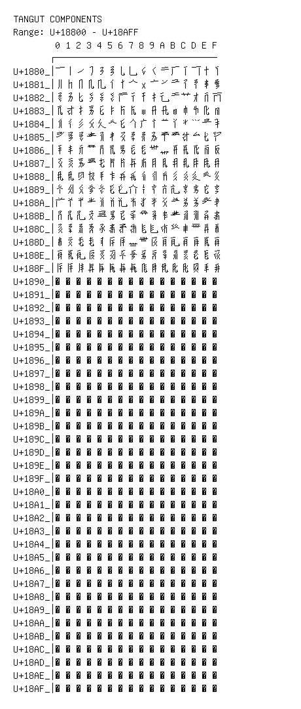

# Tangut Components

**Range:** `U+18800` - `U+18AFF`

[← Back to Index](../README.md)

```text
        0 1 2 3 4 5 6 7 8 9 A B C D E F
       ┌───────────────────────────────
U+1880_│𘠀𘠁𘠂𘠃𘠄𘠅𘠆𘠇𘠈𘠉𘠊𘠋𘠌𘠍𘠎𘠏
U+1881_│𘠐𘠑𘠒𘠓𘠔𘠕𘠖𘠗𘠘𘠙𘠚𘠛𘠜𘠝𘠞𘠟
U+1882_│𘠠𘠡𘠢𘠣𘠤𘠥𘠦𘠧𘠨𘠩𘠪𘠫𘠬𘠭𘠮𘠯
U+1883_│𘠰𘠱𘠲𘠳𘠴𘠵𘠶𘠷𘠸𘠹𘠺𘠻𘠼𘠽𘠾𘠿
U+1884_│𘡀𘡁𘡂𘡃𘡄𘡅𘡆𘡇𘡈𘡉𘡊𘡋𘡌𘡍𘡎𘡏
U+1885_│𘡐𘡑𘡒𘡓𘡔𘡕𘡖𘡗𘡘𘡙𘡚𘡛𘡜𘡝𘡞𘡟
U+1886_│𘡠𘡡𘡢𘡣𘡤𘡥𘡦𘡧𘡨𘡩𘡪𘡫𘡬𘡭𘡮𘡯
U+1887_│𘡰𘡱𘡲𘡳𘡴𘡵𘡶𘡷𘡸𘡹𘡺𘡻𘡼𘡽𘡾𘡿
U+1888_│𘢀𘢁𘢂𘢃𘢄𘢅𘢆𘢇𘢈𘢉𘢊𘢋𘢌𘢍𘢎𘢏
U+1889_│𘢐𘢑𘢒𘢓𘢔𘢕𘢖𘢗𘢘𘢙𘢚𘢛𘢜𘢝𘢞𘢟
U+188A_│𘢠𘢡𘢢𘢣𘢤𘢥𘢦𘢧𘢨𘢩𘢪𘢫𘢬𘢭𘢮𘢯
U+188B_│𘢰𘢱𘢲𘢳𘢴𘢵𘢶𘢷𘢸𘢹𘢺𘢻𘢼𘢽𘢾𘢿
U+188C_│𘣀𘣁𘣂𘣃𘣄𘣅𘣆𘣇𘣈𘣉𘣊𘣋𘣌𘣍𘣎𘣏
U+188D_│𘣐𘣑𘣒𘣓𘣔𘣕𘣖𘣗𘣘𘣙𘣚𘣛𘣜𘣝𘣞𘣟
U+188E_│𘣠𘣡𘣢𘣣𘣤𘣥𘣦𘣧𘣨𘣩𘣪𘣫𘣬𘣭𘣮𘣯
U+188F_│𘣰𘣱𘣲𘣳𘣴𘣵𘣶𘣷𘣸𘣹𘣺𘣻𘣼𘣽𘣾𘣿
U+1890_│𘤀𘤁𘤂𘤃𘤄𘤅𘤆𘤇𘤈𘤉𘤊𘤋𘤌𘤍𘤎𘤏
U+1891_│𘤐𘤑𘤒𘤓𘤔𘤕𘤖𘤗𘤘𘤙𘤚𘤛𘤜𘤝𘤞𘤟
U+1892_│𘤠𘤡𘤢𘤣𘤤𘤥𘤦𘤧𘤨𘤩𘤪𘤫𘤬𘤭𘤮𘤯
U+1893_│𘤰𘤱𘤲𘤳𘤴𘤵𘤶𘤷𘤸𘤹𘤺𘤻𘤼𘤽𘤾𘤿
U+1894_│𘥀𘥁𘥂𘥃𘥄𘥅𘥆𘥇𘥈𘥉𘥊𘥋𘥌𘥍𘥎𘥏
U+1895_│𘥐𘥑𘥒𘥓𘥔𘥕𘥖𘥗𘥘𘥙𘥚𘥛𘥜𘥝𘥞𘥟
U+1896_│𘥠𘥡𘥢𘥣𘥤𘥥𘥦𘥧𘥨𘥩𘥪𘥫𘥬𘥭𘥮𘥯
U+1897_│𘥰𘥱𘥲𘥳𘥴𘥵𘥶𘥷𘥸𘥹𘥺𘥻𘥼𘥽𘥾𘥿
U+1898_│𘦀𘦁𘦂𘦃𘦄𘦅𘦆𘦇𘦈𘦉𘦊𘦋𘦌𘦍𘦎𘦏
U+1899_│𘦐𘦑𘦒𘦓𘦔𘦕𘦖𘦗𘦘𘦙𘦚𘦛𘦜𘦝𘦞𘦟
U+189A_│𘦠𘦡𘦢𘦣𘦤𘦥𘦦𘦧𘦨𘦩𘦪𘦫𘦬𘦭𘦮𘦯
U+189B_│𘦰𘦱𘦲𘦳𘦴𘦵𘦶𘦷𘦸𘦹𘦺𘦻𘦼𘦽𘦾𘦿
U+189C_│𘧀𘧁𘧂𘧃𘧄𘧅𘧆𘧇𘧈𘧉𘧊𘧋𘧌𘧍𘧎𘧏
U+189D_│𘧐𘧑𘧒𘧓𘧔𘧕𘧖𘧗𘧘𘧙𘧚𘧛𘧜𘧝𘧞𘧟
U+189E_│𘧠𘧡𘧢𘧣𘧤𘧥𘧦𘧧𘧨𘧩𘧪𘧫𘧬𘧭𘧮𘧯
U+189F_│𘧰𘧱𘧲𘧳𘧴𘧵𘧶𘧷𘧸𘧹𘧺𘧻𘧼𘧽𘧾𘧿
U+18A0_│𘨀𘨁𘨂𘨃𘨄𘨅𘨆𘨇𘨈𘨉𘨊𘨋𘨌𘨍𘨎𘨏
U+18A1_│𘨐𘨑𘨒𘨓𘨔𘨕𘨖𘨗𘨘𘨙𘨚𘨛𘨜𘨝𘨞𘨟
U+18A2_│𘨠𘨡𘨢𘨣𘨤𘨥𘨦𘨧𘨨𘨩𘨪𘨫𘨬𘨭𘨮𘨯
U+18A3_│𘨰𘨱𘨲𘨳𘨴𘨵𘨶𘨷𘨸𘨹𘨺𘨻𘨼𘨽𘨾𘨿
U+18A4_│𘩀𘩁𘩂𘩃𘩄𘩅𘩆𘩇𘩈𘩉𘩊𘩋𘩌𘩍𘩎𘩏
U+18A5_│𘩐𘩑𘩒𘩓𘩔𘩕𘩖𘩗𘩘𘩙𘩚𘩛𘩜𘩝𘩞𘩟
U+18A6_│𘩠𘩡𘩢𘩣𘩤𘩥𘩦𘩧𘩨𘩩𘩪𘩫𘩬𘩭𘩮𘩯
U+18A7_│𘩰𘩱𘩲𘩳𘩴𘩵𘩶𘩷𘩸𘩹𘩺𘩻𘩼𘩽𘩾𘩿
U+18A8_│𘪀𘪁𘪂𘪃𘪄𘪅𘪆𘪇𘪈𘪉𘪊𘪋𘪌𘪍𘪎𘪏
U+18A9_│𘪐𘪑𘪒𘪓𘪔𘪕𘪖𘪗𘪘𘪙𘪚𘪛𘪜𘪝𘪞𘪟
U+18AA_│𘪠𘪡𘪢𘪣𘪤𘪥𘪦𘪧𘪨𘪩𘪪𘪫𘪬𘪭𘪮𘪯
U+18AB_│𘪰𘪱𘪲𘪳𘪴𘪵𘪶𘪷𘪸𘪹𘪺𘪻𘪼𘪽𘪾𘪿
U+18AC_│𘫀𘫁𘫂𘫃𘫄𘫅𘫆𘫇𘫈𘫉𘫊𘫋𘫌𘫍𘫎𘫏
U+18AD_│𘫐𘫑𘫒𘫓𘫔𘫕𘫖𘫗𘫘𘫙𘫚𘫛𘫜𘫝𘫞𘫟
U+18AE_│𘫠𘫡𘫢𘫣𘫤𘫥𘫦𘫧𘫨𘫩𘫪𘫫𘫬𘫭𘫮𘫯
U+18AF_│𘫰𘫱𘫲𘫳𘫴𘫵𘫶𘫷𘫸𘫹𘫺𘫻𘫼𘫽𘫾𘫿
```

## Visual Fallback Reference
If your system lacks the required fonts to render these characters properly, use the image below as a visual guide.


