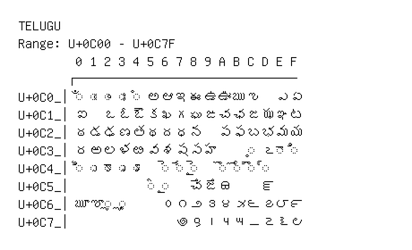

# Telugu

**Range:** `U+0C00` - `U+0C7F`

[← Back to Index](../README.md)

```text
        0 1 2 3 4 5 6 7 8 9 A B C D E F
       ┌───────────────────────────────
U+0C0_│◌ఀ ◌ఁ ◌ం ◌ః ◌ఄ అ ఆ ఇ ఈ ఉ ఊ ఋ ఌ   ఎ ఏ
U+0C1_│ఐ   ఒ ఓ ఔ క ఖ గ ఘ ఙ చ ఛ జ ఝ ఞ ట
U+0C2_│ఠ డ ఢ ణ త థ ద ధ న   ప ఫ బ భ మ య
U+0C3_│ర ఱ ల ళ ఴ వ శ ష స హ     ◌఼ ఽ ◌ా ◌ి
U+0C4_│◌ీ ◌ు ◌ూ ◌ృ ◌ౄ   ◌ె ◌ే ◌ై   ◌ొ ◌ో ◌ౌ ◌్
U+0C5_│          ◌ౕ ◌ౖ   ౘ ౙ ౚ     ౝ
U+0C6_│ౠ ౡ ◌ౢ ◌ౣ     ౦ ౧ ౨ ౩ ౪ ౫ ౬ ౭ ౮ ౯
U+0C7_│              ౷ ౸ ౹ ౺ ౻ ౼ ౽ ౾ ౿
```

## Visual Fallback Reference
If your system lacks the required fonts to render these characters properly, use the image below as a visual guide.


