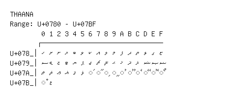

# Thaana

**Range:** `U+0780` - `U+07BF`

[← Back to Index](../README.md)

```text
        0 1 2 3 4 5 6 7 8 9 A B C D E F
       ┌───────────────────────────────
U+078_│ހ ށ ނ ރ ބ ޅ ކ އ ވ މ ފ ދ ތ ލ ގ ޏ
U+079_│ސ ޑ ޒ ޓ ޔ ޕ ޖ ޗ ޘ ޙ ޚ ޛ ޜ ޝ ޞ ޟ
U+07A_│ޠ ޡ ޢ ޣ ޤ ޥ ◌ަ ◌ާ ◌ި ◌ީ ◌ު ◌ޫ ◌ެ ◌ޭ ◌ޮ ◌ޯ
U+07B_│◌ް ޱ
```

## Visual Fallback Reference
If your system lacks the required fonts to render these characters properly, use the image below as a visual guide.


