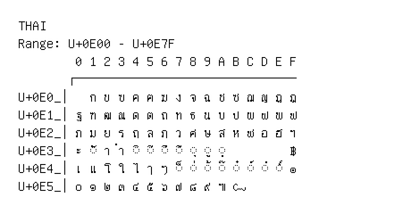

# Thai

**Range:** `U+0E00` - `U+0E7F`

[← Back to Index](../README.md)

```text
        0 1 2 3 4 5 6 7 8 9 A B C D E F
       ┌───────────────────────────────
U+0E0_│  ก ข ฃ ค ฅ ฆ ง จ ฉ ช ซ ฌ ญ ฎ ฏ
U+0E1_│ฐ ฑ ฒ ณ ด ต ถ ท ธ น บ ป ผ ฝ พ ฟ
U+0E2_│ภ ม ย ร ฤ ล ฦ ว ศ ษ ส ห ฬ อ ฮ ฯ
U+0E3_│ะ ◌ั า ำ ◌ิ ◌ี ◌ึ ◌ื ◌ุ ◌ู ◌ฺ         ฿
U+0E4_│เ แ โ ใ ไ ๅ ๆ ◌็ ◌่ ◌้ ◌๊ ◌๋ ◌์ ◌ํ ◌๎ ๏
U+0E5_│๐ ๑ ๒ ๓ ๔ ๕ ๖ ๗ ๘ ๙ ๚ ๛
```

## Visual Fallback Reference
If your system lacks the required fonts to render these characters properly, use the image below as a visual guide.


