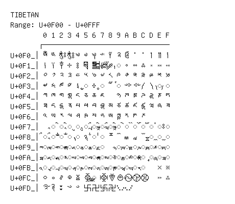

# Tibetan

**Range:** `U+0F00` - `U+0FFF`

[← Back to Index](../README.md)

```text
        0 1 2 3 4 5 6 7 8 9 A B C D E F
       ┌───────────────────────────────
U+0F0_│ༀ ༁ ༂ ༃ ༄ ༅ ༆ ༇ ༈ ༉ ༊ ་ ༌ ། ༎ ༏
U+0F1_│༐ ༑ ༒ ༓ ༔ ༕ ༖ ༗ ◌༘ ◌༙ ༚ ༛ ༜ ༝ ༞ ༟
U+0F2_│༠ ༡ ༢ ༣ ༤ ༥ ༦ ༧ ༨ ༩ ༪ ༫ ༬ ༭ ༮ ༯
U+0F3_│༰ ༱ ༲ ༳ ༴ ◌༵ ༶ ◌༷ ༸ ◌༹ ༺ ༻ ༼ ༽ ◌༾ ◌༿
U+0F4_│ཀ ཁ ག གྷ ང ཅ ཆ ཇ   ཉ ཊ ཋ ཌ ཌྷ ཎ ཏ
U+0F5_│ཐ ད དྷ ན པ ཕ བ བྷ མ ཙ ཚ ཛ ཛྷ ཝ ཞ ཟ
U+0F6_│འ ཡ ར ལ ཤ ཥ ས ཧ ཨ ཀྵ ཪ ཫ ཬ
U+0F7_│  ◌ཱ ◌ི ◌ཱི ◌ུ ◌ཱུ ◌ྲྀ ◌ཷ ◌ླྀ ◌ཹ ◌ེ ◌ཻ ◌ོ ◌ཽ ◌ཾ ◌ཿ
U+0F8_│◌ྀ ◌ཱྀ ◌ྂ ◌ྃ ◌྄ ྅ ◌྆ ◌྇ ྈ ྉ ྊ ྋ ྌ ◌ྍ ◌ྎ ◌ྏ
U+0F9_│◌ྐ ◌ྑ ◌ྒ ◌ྒྷ ◌ྔ ◌ྕ ◌ྖ ◌ྗ   ◌ྙ ◌ྚ ◌ྛ ◌ྜ ◌ྜྷ ◌ྞ ◌ྟ
U+0FA_│◌ྠ ◌ྡ ◌ྡྷ ◌ྣ ◌ྤ ◌ྥ ◌ྦ ◌ྦྷ ◌ྨ ◌ྩ ◌ྪ ◌ྫ ◌ྫྷ ◌ྭ ◌ྮ ◌ྯ
U+0FB_│◌ྰ ◌ྱ ◌ྲ ◌ླ ◌ྴ ◌ྵ ◌ྶ ◌ྷ ◌ྸ ◌ྐྵ ◌ྺ ◌ྻ ◌ྼ   ྾ ྿
U+0FC_│࿀ ࿁ ࿂ ࿃ ࿄ ࿅ ◌࿆ ࿇ ࿈ ࿉ ࿊ ࿋ ࿌   ࿎ ࿏
U+0FD_│࿐ ࿑ ࿒ ࿓ ࿔ ࿕ ࿖ ࿗ ࿘ ࿙ ࿚
```

## Visual Fallback Reference
If your system lacks the required fonts to render these characters properly, use the image below as a visual guide.


