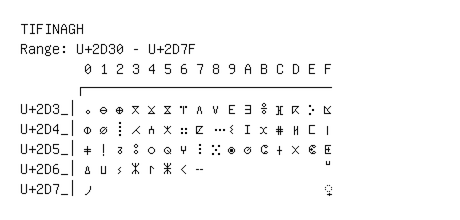

# Tifinagh

**Range:** `U+2D30` - `U+2D7F`

[← Back to Index](../README.md)

```text
        0 1 2 3 4 5 6 7 8 9 A B C D E F
       ┌───────────────────────────────
U+2D3_│ⴰ ⴱ ⴲ ⴳ ⴴ ⴵ ⴶ ⴷ ⴸ ⴹ ⴺ ⴻ ⴼ ⴽ ⴾ ⴿ
U+2D4_│ⵀ ⵁ ⵂ ⵃ ⵄ ⵅ ⵆ ⵇ ⵈ ⵉ ⵊ ⵋ ⵌ ⵍ ⵎ ⵏ
U+2D5_│ⵐ ⵑ ⵒ ⵓ ⵔ ⵕ ⵖ ⵗ ⵘ ⵙ ⵚ ⵛ ⵜ ⵝ ⵞ ⵟ
U+2D6_│ⵠ ⵡ ⵢ ⵣ ⵤ ⵥ ⵦ ⵧ               ⵯ
U+2D7_│⵰                             ◌⵿
```

## Visual Fallback Reference
If your system lacks the required fonts to render these characters properly, use the image below as a visual guide.


