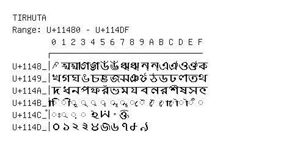

# Tirhuta

**Range:** `U+11480` - `U+114DF`

[← Back to Index](../README.md)

```text
        0 1 2 3 4 5 6 7 8 9 A B C D E F
       ┌───────────────────────────────
U+1148_│𑒀 𑒁 𑒂 𑒃 𑒄 𑒅 𑒆 𑒇 𑒈 𑒉 𑒊 𑒋 𑒌 𑒍 𑒎 𑒏
U+1149_│𑒐 𑒑 𑒒 𑒓 𑒔 𑒕 𑒖 𑒗 𑒘 𑒙 𑒚 𑒛 𑒜 𑒝 𑒞 𑒟
U+114A_│𑒠 𑒡 𑒢 𑒣 𑒤 𑒥 𑒦 𑒧 𑒨 𑒩 𑒪 𑒫 𑒬 𑒭 𑒮 𑒯
U+114B_│◌𑒰 ◌𑒱 ◌𑒲 ◌𑒳 ◌𑒴 ◌𑒵 ◌𑒶 ◌𑒷 ◌𑒸 ◌𑒹 ◌𑒺 ◌𑒻 ◌𑒼 ◌𑒽 ◌𑒾 ◌𑒿
U+114C_│◌𑓀 ◌𑓁 ◌𑓂 ◌𑓃 𑓄 𑓅 𑓆 𑓇
U+114D_│𑓐 𑓑 𑓒 𑓓 𑓔 𑓕 𑓖 𑓗 𑓘 𑓙
```

## Visual Fallback Reference
If your system lacks the required fonts to render these characters properly, use the image below as a visual guide.


