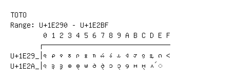

# Toto

**Range:** `U+1E290` - `U+1E2BF`

[← Back to Index](../README.md)

```text
        0 1 2 3 4 5 6 7 8 9 A B C D E F
       ┌───────────────────────────────
U+1E29_│𞊐 𞊑 𞊒 𞊓 𞊔 𞊕 𞊖 𞊗 𞊘 𞊙 𞊚 𞊛 𞊜 𞊝 𞊞 𞊟
U+1E2A_│𞊠 𞊡 𞊢 𞊣 𞊤 𞊥 𞊦 𞊧 𞊨 𞊩 𞊪 𞊫 𞊬 𞊭 ◌𞊮
```

## Visual Fallback Reference
If your system lacks the required fonts to render these characters properly, use the image below as a visual guide.


