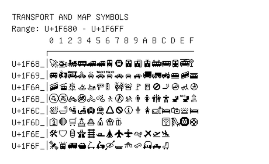

# Transport and Map Symbols

**Range:** `U+1F680` - `U+1F6FF`

[← Back to Index](../README.md)

```text
        0 1 2 3 4 5 6 7 8 9 A B C D E F
       ┌───────────────────────────────
U+1F68_│🚀🚁🚂🚃🚄🚅🚆🚇🚈🚉🚊🚋🚌🚍🚎🚏
U+1F69_│🚐🚑🚒🚓🚔🚕🚖🚗🚘🚙🚚🚛🚜🚝🚞🚟
U+1F6A_│🚠🚡🚢🚣🚤🚥🚦🚧🚨🚩🚪🚫🚬🚭🚮🚯
U+1F6B_│🚰🚱🚲🚳🚴🚵🚶🚷🚸🚹🚺🚻🚼🚽🚾🚿
U+1F6C_│🛀🛁🛂🛃🛄🛅🛆 🛇 🛈 🛉 🛊 🛋 🛌🛍 🛎 🛏
U+1F6D_│🛐🛑🛒🛓 🛔 🛕🛖🛗        🛜🛝🛞🛟
U+1F6E_│🛠 🛡 🛢 🛣 🛤 🛥 🛦 🛧 🛨 🛩 🛪 🛫🛬
U+1F6F_│🛰 🛱 🛲 🛳 🛴🛵🛶🛷🛸🛹🛺🛻🛼
```

## Visual Fallback Reference
If your system lacks the required fonts to render these characters properly, use the image below as a visual guide.


