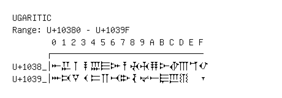

# Ugaritic

**Range:** `U+10380` - `U+1039F`

[← Back to Index](../README.md)

```text
        0 1 2 3 4 5 6 7 8 9 A B C D E F
       ┌───────────────────────────────
U+1038_│𐎀 𐎁 𐎂 𐎃 𐎄 𐎅 𐎆 𐎇 𐎈 𐎉 𐎊 𐎋 𐎌 𐎍 𐎎 𐎏
U+1039_│𐎐 𐎑 𐎒 𐎓 𐎔 𐎕 𐎖 𐎗 𐎘 𐎙 𐎚 𐎛 𐎜 𐎝   𐎟
```

## Visual Fallback Reference
If your system lacks the required fonts to render these characters properly, use the image below as a visual guide.


