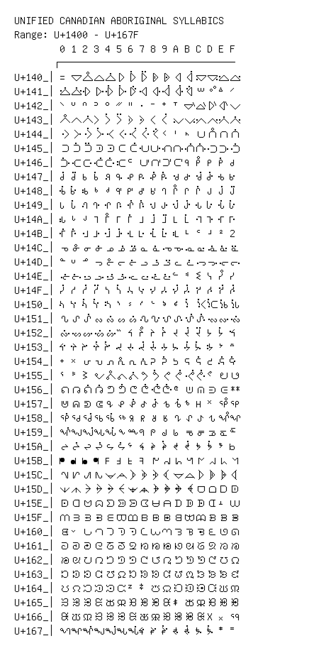

# Unified Canadian Aboriginal Syllabics

**Range:** `U+1400` - `U+167F`

[← Back to Index](../README.md)

```text
        0 1 2 3 4 5 6 7 8 9 A B C D E F
       ┌───────────────────────────────
U+140_│᐀ ᐁ ᐂ ᐃ ᐄ ᐅ ᐆ ᐇ ᐈ ᐉ ᐊ ᐋ ᐌ ᐍ ᐎ ᐏ
U+141_│ᐐ ᐑ ᐒ ᐓ ᐔ ᐕ ᐖ ᐗ ᐘ ᐙ ᐚ ᐛ ᐜ ᐝ ᐞ ᐟ
U+142_│ᐠ ᐡ ᐢ ᐣ ᐤ ᐥ ᐦ ᐧ ᐨ ᐩ ᐪ ᐫ ᐬ ᐭ ᐮ ᐯ
U+143_│ᐰ ᐱ ᐲ ᐳ ᐴ ᐵ ᐶ ᐷ ᐸ ᐹ ᐺ ᐻ ᐼ ᐽ ᐾ ᐿ
U+144_│ᑀ ᑁ ᑂ ᑃ ᑄ ᑅ ᑆ ᑇ ᑈ ᑉ ᑊ ᑋ ᑌ ᑍ ᑎ ᑏ
U+145_│ᑐ ᑑ ᑒ ᑓ ᑔ ᑕ ᑖ ᑗ ᑘ ᑙ ᑚ ᑛ ᑜ ᑝ ᑞ ᑟ
U+146_│ᑠ ᑡ ᑢ ᑣ ᑤ ᑥ ᑦ ᑧ ᑨ ᑩ ᑪ ᑫ ᑬ ᑭ ᑮ ᑯ
U+147_│ᑰ ᑱ ᑲ ᑳ ᑴ ᑵ ᑶ ᑷ ᑸ ᑹ ᑺ ᑻ ᑼ ᑽ ᑾ ᑿ
U+148_│ᒀ ᒁ ᒂ ᒃ ᒄ ᒅ ᒆ ᒇ ᒈ ᒉ ᒊ ᒋ ᒌ ᒍ ᒎ ᒏ
U+149_│ᒐ ᒑ ᒒ ᒓ ᒔ ᒕ ᒖ ᒗ ᒘ ᒙ ᒚ ᒛ ᒜ ᒝ ᒞ ᒟ
U+14A_│ᒠ ᒡ ᒢ ᒣ ᒤ ᒥ ᒦ ᒧ ᒨ ᒩ ᒪ ᒫ ᒬ ᒭ ᒮ ᒯ
U+14B_│ᒰ ᒱ ᒲ ᒳ ᒴ ᒵ ᒶ ᒷ ᒸ ᒹ ᒺ ᒻ ᒼ ᒽ ᒾ ᒿ
U+14C_│ᓀ ᓁ ᓂ ᓃ ᓄ ᓅ ᓆ ᓇ ᓈ ᓉ ᓊ ᓋ ᓌ ᓍ ᓎ ᓏ
U+14D_│ᓐ ᓑ ᓒ ᓓ ᓔ ᓕ ᓖ ᓗ ᓘ ᓙ ᓚ ᓛ ᓜ ᓝ ᓞ ᓟ
U+14E_│ᓠ ᓡ ᓢ ᓣ ᓤ ᓥ ᓦ ᓧ ᓨ ᓩ ᓪ ᓫ ᓬ ᓭ ᓮ ᓯ
U+14F_│ᓰ ᓱ ᓲ ᓳ ᓴ ᓵ ᓶ ᓷ ᓸ ᓹ ᓺ ᓻ ᓼ ᓽ ᓾ ᓿ
U+150_│ᔀ ᔁ ᔂ ᔃ ᔄ ᔅ ᔆ ᔇ ᔈ ᔉ ᔊ ᔋ ᔌ ᔍ ᔎ ᔏ
U+151_│ᔐ ᔑ ᔒ ᔓ ᔔ ᔕ ᔖ ᔗ ᔘ ᔙ ᔚ ᔛ ᔜ ᔝ ᔞ ᔟ
U+152_│ᔠ ᔡ ᔢ ᔣ ᔤ ᔥ ᔦ ᔧ ᔨ ᔩ ᔪ ᔫ ᔬ ᔭ ᔮ ᔯ
U+153_│ᔰ ᔱ ᔲ ᔳ ᔴ ᔵ ᔶ ᔷ ᔸ ᔹ ᔺ ᔻ ᔼ ᔽ ᔾ ᔿ
U+154_│ᕀ ᕁ ᕂ ᕃ ᕄ ᕅ ᕆ ᕇ ᕈ ᕉ ᕊ ᕋ ᕌ ᕍ ᕎ ᕏ
U+155_│ᕐ ᕑ ᕒ ᕓ ᕔ ᕕ ᕖ ᕗ ᕘ ᕙ ᕚ ᕛ ᕜ ᕝ ᕞ ᕟ
U+156_│ᕠ ᕡ ᕢ ᕣ ᕤ ᕥ ᕦ ᕧ ᕨ ᕩ ᕪ ᕫ ᕬ ᕭ ᕮ ᕯ
U+157_│ᕰ ᕱ ᕲ ᕳ ᕴ ᕵ ᕶ ᕷ ᕸ ᕹ ᕺ ᕻ ᕼ ᕽ ᕾ ᕿ
U+158_│ᖀ ᖁ ᖂ ᖃ ᖄ ᖅ ᖆ ᖇ ᖈ ᖉ ᖊ ᖋ ᖌ ᖍ ᖎ ᖏ
U+159_│ᖐ ᖑ ᖒ ᖓ ᖔ ᖕ ᖖ ᖗ ᖘ ᖙ ᖚ ᖛ ᖜ ᖝ ᖞ ᖟ
U+15A_│ᖠ ᖡ ᖢ ᖣ ᖤ ᖥ ᖦ ᖧ ᖨ ᖩ ᖪ ᖫ ᖬ ᖭ ᖮ ᖯ
U+15B_│ᖰ ᖱ ᖲ ᖳ ᖴ ᖵ ᖶ ᖷ ᖸ ᖹ ᖺ ᖻ ᖼ ᖽ ᖾ ᖿ
U+15C_│ᗀ ᗁ ᗂ ᗃ ᗄ ᗅ ᗆ ᗇ ᗈ ᗉ ᗊ ᗋ ᗌ ᗍ ᗎ ᗏ
U+15D_│ᗐ ᗑ ᗒ ᗓ ᗔ ᗕ ᗖ ᗗ ᗘ ᗙ ᗚ ᗛ ᗜ ᗝ ᗞ ᗟ
U+15E_│ᗠ ᗡ ᗢ ᗣ ᗤ ᗥ ᗦ ᗧ ᗨ ᗩ ᗪ ᗫ ᗬ ᗭ ᗮ ᗯ
U+15F_│ᗰ ᗱ ᗲ ᗳ ᗴ ᗵ ᗶ ᗷ ᗸ ᗹ ᗺ ᗻ ᗼ ᗽ ᗾ ᗿ
U+160_│ᘀ ᘁ ᘂ ᘃ ᘄ ᘅ ᘆ ᘇ ᘈ ᘉ ᘊ ᘋ ᘌ ᘍ ᘎ ᘏ
U+161_│ᘐ ᘑ ᘒ ᘓ ᘔ ᘕ ᘖ ᘗ ᘘ ᘙ ᘚ ᘛ ᘜ ᘝ ᘞ ᘟ
U+162_│ᘠ ᘡ ᘢ ᘣ ᘤ ᘥ ᘦ ᘧ ᘨ ᘩ ᘪ ᘫ ᘬ ᘭ ᘮ ᘯ
U+163_│ᘰ ᘱ ᘲ ᘳ ᘴ ᘵ ᘶ ᘷ ᘸ ᘹ ᘺ ᘻ ᘼ ᘽ ᘾ ᘿ
U+164_│ᙀ ᙁ ᙂ ᙃ ᙄ ᙅ ᙆ ᙇ ᙈ ᙉ ᙊ ᙋ ᙌ ᙍ ᙎ ᙏ
U+165_│ᙐ ᙑ ᙒ ᙓ ᙔ ᙕ ᙖ ᙗ ᙘ ᙙ ᙚ ᙛ ᙜ ᙝ ᙞ ᙟ
U+166_│ᙠ ᙡ ᙢ ᙣ ᙤ ᙥ ᙦ ᙧ ᙨ ᙩ ᙪ ᙫ ᙬ ᙭ ᙮ ᙯ
U+167_│ᙰ ᙱ ᙲ ᙳ ᙴ ᙵ ᙶ ᙷ ᙸ ᙹ ᙺ ᙻ ᙼ ᙽ ᙾ ᙿ
```

## Visual Fallback Reference
If your system lacks the required fonts to render these characters properly, use the image below as a visual guide.


