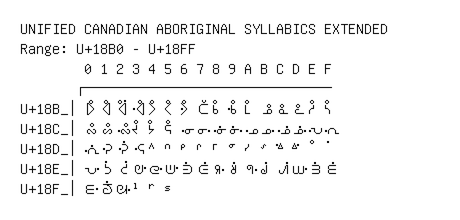

# Unified Canadian Aboriginal Syllabics Extended

**Range:** `U+18B0` - `U+18FF`

[← Back to Index](../README.md)

```text
        0 1 2 3 4 5 6 7 8 9 A B C D E F
       ┌───────────────────────────────
U+18B_│ᢰ ᢱ ᢲ ᢳ ᢴ ᢵ ᢶ ᢷ ᢸ ᢹ ᢺ ᢻ ᢼ ᢽ ᢾ ᢿ
U+18C_│ᣀ ᣁ ᣂ ᣃ ᣄ ᣅ ᣆ ᣇ ᣈ ᣉ ᣊ ᣋ ᣌ ᣍ ᣎ ᣏ
U+18D_│ᣐ ᣑ ᣒ ᣓ ᣔ ᣕ ᣖ ᣗ ᣘ ᣙ ᣚ ᣛ ᣜ ᣝ ᣞ ᣟ
U+18E_│ᣠ ᣡ ᣢ ᣣ ᣤ ᣥ ᣦ ᣧ ᣨ ᣩ ᣪ ᣫ ᣬ ᣭ ᣮ ᣯ
U+18F_│ᣰ ᣱ ᣲ ᣳ ᣴ ᣵ
```

## Visual Fallback Reference
If your system lacks the required fonts to render these characters properly, use the image below as a visual guide.


