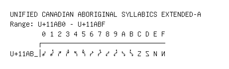

# Unified Canadian Aboriginal Syllabics Extended-A

**Range:** `U+11AB0` - `U+11ABF`

[← Back to Index](../README.md)

```text
        0 1 2 3 4 5 6 7 8 9 A B C D E F
       ┌───────────────────────────────
U+11AB_│𑪰 𑪱 𑪲 𑪳 𑪴 𑪵 𑪶 𑪷 𑪸 𑪹 𑪺 𑪻 𑪼 𑪽 𑪾 𑪿
```

## Visual Fallback Reference
If your system lacks the required fonts to render these characters properly, use the image below as a visual guide.


