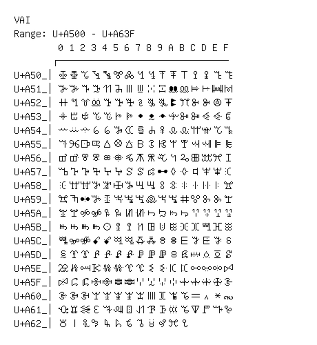

# Vai

**Range:** `U+A500` - `U+A63F`

[← Back to Index](../README.md)

```text
        0 1 2 3 4 5 6 7 8 9 A B C D E F
       ┌───────────────────────────────
U+A50_│ꔀ ꔁ ꔂ ꔃ ꔄ ꔅ ꔆ ꔇ ꔈ ꔉ ꔊ ꔋ ꔌ ꔍ ꔎ ꔏ
U+A51_│ꔐ ꔑ ꔒ ꔓ ꔔ ꔕ ꔖ ꔗ ꔘ ꔙ ꔚ ꔛ ꔜ ꔝ ꔞ ꔟ
U+A52_│ꔠ ꔡ ꔢ ꔣ ꔤ ꔥ ꔦ ꔧ ꔨ ꔩ ꔪ ꔫ ꔬ ꔭ ꔮ ꔯ
U+A53_│ꔰ ꔱ ꔲ ꔳ ꔴ ꔵ ꔶ ꔷ ꔸ ꔹ ꔺ ꔻ ꔼ ꔽ ꔾ ꔿ
U+A54_│ꕀ ꕁ ꕂ ꕃ ꕄ ꕅ ꕆ ꕇ ꕈ ꕉ ꕊ ꕋ ꕌ ꕍ ꕎ ꕏ
U+A55_│ꕐ ꕑ ꕒ ꕓ ꕔ ꕕ ꕖ ꕗ ꕘ ꕙ ꕚ ꕛ ꕜ ꕝ ꕞ ꕟ
U+A56_│ꕠ ꕡ ꕢ ꕣ ꕤ ꕥ ꕦ ꕧ ꕨ ꕩ ꕪ ꕫ ꕬ ꕭ ꕮ ꕯ
U+A57_│ꕰ ꕱ ꕲ ꕳ ꕴ ꕵ ꕶ ꕷ ꕸ ꕹ ꕺ ꕻ ꕼ ꕽ ꕾ ꕿ
U+A58_│ꖀ ꖁ ꖂ ꖃ ꖄ ꖅ ꖆ ꖇ ꖈ ꖉ ꖊ ꖋ ꖌ ꖍ ꖎ ꖏ
U+A59_│ꖐ ꖑ ꖒ ꖓ ꖔ ꖕ ꖖ ꖗ ꖘ ꖙ ꖚ ꖛ ꖜ ꖝ ꖞ ꖟ
U+A5A_│ꖠ ꖡ ꖢ ꖣ ꖤ ꖥ ꖦ ꖧ ꖨ ꖩ ꖪ ꖫ ꖬ ꖭ ꖮ ꖯ
U+A5B_│ꖰ ꖱ ꖲ ꖳ ꖴ ꖵ ꖶ ꖷ ꖸ ꖹ ꖺ ꖻ ꖼ ꖽ ꖾ ꖿ
U+A5C_│ꗀ ꗁ ꗂ ꗃ ꗄ ꗅ ꗆ ꗇ ꗈ ꗉ ꗊ ꗋ ꗌ ꗍ ꗎ ꗏ
U+A5D_│ꗐ ꗑ ꗒ ꗓ ꗔ ꗕ ꗖ ꗗ ꗘ ꗙ ꗚ ꗛ ꗜ ꗝ ꗞ ꗟ
U+A5E_│ꗠ ꗡ ꗢ ꗣ ꗤ ꗥ ꗦ ꗧ ꗨ ꗩ ꗪ ꗫ ꗬ ꗭ ꗮ ꗯ
U+A5F_│ꗰ ꗱ ꗲ ꗳ ꗴ ꗵ ꗶ ꗷ ꗸ ꗹ ꗺ ꗻ ꗼ ꗽ ꗾ ꗿ
U+A60_│ꘀ ꘁ ꘂ ꘃ ꘄ ꘅ ꘆ ꘇ ꘈ ꘉ ꘊ ꘋ ꘌ ꘍ ꘎ ꘏
U+A61_│ꘐ ꘑ ꘒ ꘓ ꘔ ꘕ ꘖ ꘗ ꘘ ꘙ ꘚ ꘛ ꘜ ꘝ ꘞ ꘟ
U+A62_│꘠ ꘡ ꘢ ꘣ ꘤ ꘥ ꘦ ꘧ ꘨ ꘩ ꘪ ꘫ
```

## Visual Fallback Reference
If your system lacks the required fonts to render these characters properly, use the image below as a visual guide.


