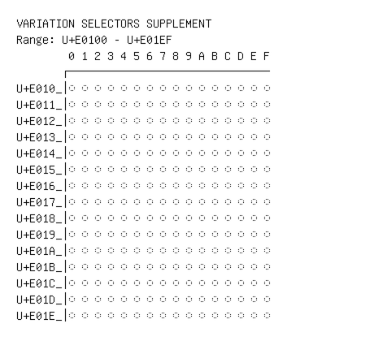

# Variation Selectors Supplement

**Range:** `U+E0100` - `U+E01EF`

[← Back to Index](../README.md)

```text
        0 1 2 3 4 5 6 7 8 9 A B C D E F
       ┌───────────────────────────────
U+E010_│◌󠄀 ◌󠄁 ◌󠄂 ◌󠄃 ◌󠄄 ◌󠄅 ◌󠄆 ◌󠄇 ◌󠄈 ◌󠄉 ◌󠄊 ◌󠄋 ◌󠄌 ◌󠄍 ◌󠄎 ◌󠄏
U+E011_│◌󠄐 ◌󠄑 ◌󠄒 ◌󠄓 ◌󠄔 ◌󠄕 ◌󠄖 ◌󠄗 ◌󠄘 ◌󠄙 ◌󠄚 ◌󠄛 ◌󠄜 ◌󠄝 ◌󠄞 ◌󠄟
U+E012_│◌󠄠 ◌󠄡 ◌󠄢 ◌󠄣 ◌󠄤 ◌󠄥 ◌󠄦 ◌󠄧 ◌󠄨 ◌󠄩 ◌󠄪 ◌󠄫 ◌󠄬 ◌󠄭 ◌󠄮 ◌󠄯
U+E013_│◌󠄰 ◌󠄱 ◌󠄲 ◌󠄳 ◌󠄴 ◌󠄵 ◌󠄶 ◌󠄷 ◌󠄸 ◌󠄹 ◌󠄺 ◌󠄻 ◌󠄼 ◌󠄽 ◌󠄾 ◌󠄿
U+E014_│◌󠅀 ◌󠅁 ◌󠅂 ◌󠅃 ◌󠅄 ◌󠅅 ◌󠅆 ◌󠅇 ◌󠅈 ◌󠅉 ◌󠅊 ◌󠅋 ◌󠅌 ◌󠅍 ◌󠅎 ◌󠅏
U+E015_│◌󠅐 ◌󠅑 ◌󠅒 ◌󠅓 ◌󠅔 ◌󠅕 ◌󠅖 ◌󠅗 ◌󠅘 ◌󠅙 ◌󠅚 ◌󠅛 ◌󠅜 ◌󠅝 ◌󠅞 ◌󠅟
U+E016_│◌󠅠 ◌󠅡 ◌󠅢 ◌󠅣 ◌󠅤 ◌󠅥 ◌󠅦 ◌󠅧 ◌󠅨 ◌󠅩 ◌󠅪 ◌󠅫 ◌󠅬 ◌󠅭 ◌󠅮 ◌󠅯
U+E017_│◌󠅰 ◌󠅱 ◌󠅲 ◌󠅳 ◌󠅴 ◌󠅵 ◌󠅶 ◌󠅷 ◌󠅸 ◌󠅹 ◌󠅺 ◌󠅻 ◌󠅼 ◌󠅽 ◌󠅾 ◌󠅿
U+E018_│◌󠆀 ◌󠆁 ◌󠆂 ◌󠆃 ◌󠆄 ◌󠆅 ◌󠆆 ◌󠆇 ◌󠆈 ◌󠆉 ◌󠆊 ◌󠆋 ◌󠆌 ◌󠆍 ◌󠆎 ◌󠆏
U+E019_│◌󠆐 ◌󠆑 ◌󠆒 ◌󠆓 ◌󠆔 ◌󠆕 ◌󠆖 ◌󠆗 ◌󠆘 ◌󠆙 ◌󠆚 ◌󠆛 ◌󠆜 ◌󠆝 ◌󠆞 ◌󠆟
U+E01A_│◌󠆠 ◌󠆡 ◌󠆢 ◌󠆣 ◌󠆤 ◌󠆥 ◌󠆦 ◌󠆧 ◌󠆨 ◌󠆩 ◌󠆪 ◌󠆫 ◌󠆬 ◌󠆭 ◌󠆮 ◌󠆯
U+E01B_│◌󠆰 ◌󠆱 ◌󠆲 ◌󠆳 ◌󠆴 ◌󠆵 ◌󠆶 ◌󠆷 ◌󠆸 ◌󠆹 ◌󠆺 ◌󠆻 ◌󠆼 ◌󠆽 ◌󠆾 ◌󠆿
U+E01C_│◌󠇀 ◌󠇁 ◌󠇂 ◌󠇃 ◌󠇄 ◌󠇅 ◌󠇆 ◌󠇇 ◌󠇈 ◌󠇉 ◌󠇊 ◌󠇋 ◌󠇌 ◌󠇍 ◌󠇎 ◌󠇏
U+E01D_│◌󠇐 ◌󠇑 ◌󠇒 ◌󠇓 ◌󠇔 ◌󠇕 ◌󠇖 ◌󠇗 ◌󠇘 ◌󠇙 ◌󠇚 ◌󠇛 ◌󠇜 ◌󠇝 ◌󠇞 ◌󠇟
U+E01E_│◌󠇠 ◌󠇡 ◌󠇢 ◌󠇣 ◌󠇤 ◌󠇥 ◌󠇦 ◌󠇧 ◌󠇨 ◌󠇩 ◌󠇪 ◌󠇫 ◌󠇬 ◌󠇭 ◌󠇮 ◌󠇯
```

## Visual Fallback Reference
If your system lacks the required fonts to render these characters properly, use the image below as a visual guide.


