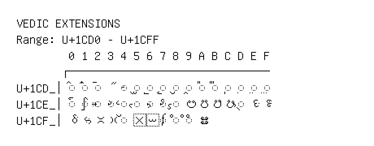

# Vedic Extensions

**Range:** `U+1CD0` - `U+1CFF`

[← Back to Index](../README.md)

```text
        0 1 2 3 4 5 6 7 8 9 A B C D E F
       ┌───────────────────────────────
U+1CD_│◌᳐ ◌᳑ ◌᳒ ᳓ ◌᳔ ◌᳕ ◌᳖ ◌᳗ ◌᳘ ◌᳙ ◌᳚ ◌᳛ ◌᳜ ◌᳝ ◌᳞ ◌᳟
U+1CE_│◌᳠ ◌᳡ ◌᳢ ◌᳣ ◌᳤ ◌᳥ ◌᳦ ◌᳧ ◌᳨ ᳩ ᳪ ᳫ ᳬ ◌᳭ ᳮ ᳯ
U+1CF_│ᳰ ᳱ ᳲ ᳳ ◌᳴ ᳵ ᳶ ◌᳷ ◌᳸ ◌᳹ ᳺ
```

## Visual Fallback Reference
If your system lacks the required fonts to render these characters properly, use the image below as a visual guide.


