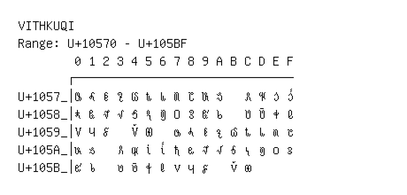

# Vithkuqi

**Range:** `U+10570` - `U+105BF`

[← Back to Index](../README.md)

```text
        0 1 2 3 4 5 6 7 8 9 A B C D E F
       ┌───────────────────────────────
U+1057_│𐕰 𐕱 𐕲 𐕳 𐕴 𐕵 𐕶 𐕷 𐕸 𐕹 𐕺   𐕼 𐕽 𐕾 𐕿
U+1058_│𐖀 𐖁 𐖂 𐖃 𐖄 𐖅 𐖆 𐖇 𐖈 𐖉 𐖊   𐖌 𐖍 𐖎 𐖏
U+1059_│𐖐 𐖑 𐖒   𐖔 𐖕   𐖗 𐖘 𐖙 𐖚 𐖛 𐖜 𐖝 𐖞 𐖟
U+105A_│𐖠 𐖡   𐖣 𐖤 𐖥 𐖦 𐖧 𐖨 𐖩 𐖪 𐖫 𐖬 𐖭 𐖮 𐖯
U+105B_│𐖰 𐖱   𐖳 𐖴 𐖵 𐖶 𐖷 𐖸 𐖹   𐖻 𐖼
```

## Visual Fallback Reference
If your system lacks the required fonts to render these characters properly, use the image below as a visual guide.


