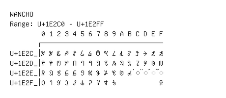

# Wancho

**Range:** `U+1E2C0` - `U+1E2FF`

[← Back to Index](../README.md)

```text
        0 1 2 3 4 5 6 7 8 9 A B C D E F
       ┌───────────────────────────────
U+1E2C_│𞋀 𞋁 𞋂 𞋃 𞋄 𞋅 𞋆 𞋇 𞋈 𞋉 𞋊 𞋋 𞋌 𞋍 𞋎 𞋏
U+1E2D_│𞋐 𞋑 𞋒 𞋓 𞋔 𞋕 𞋖 𞋗 𞋘 𞋙 𞋚 𞋛 𞋜 𞋝 𞋞 𞋟
U+1E2E_│𞋠 𞋡 𞋢 𞋣 𞋤 𞋥 𞋦 𞋧 𞋨 𞋩 𞋪 𞋫 ◌𞋬 ◌𞋭 ◌𞋮 ◌𞋯
U+1E2F_│𞋰 𞋱 𞋲 𞋳 𞋴 𞋵 𞋶 𞋷 𞋸 𞋹           𞋿
```

## Visual Fallback Reference
If your system lacks the required fonts to render these characters properly, use the image below as a visual guide.


