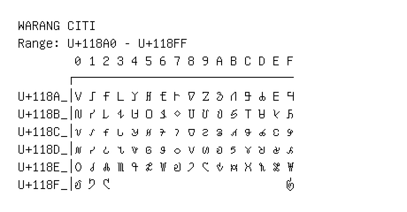

# Warang Citi

**Range:** `U+118A0` - `U+118FF`

[← Back to Index](../README.md)

```text
        0 1 2 3 4 5 6 7 8 9 A B C D E F
       ┌───────────────────────────────
U+118A_│𑢠 𑢡 𑢢 𑢣 𑢤 𑢥 𑢦 𑢧 𑢨 𑢩 𑢪 𑢫 𑢬 𑢭 𑢮 𑢯
U+118B_│𑢰 𑢱 𑢲 𑢳 𑢴 𑢵 𑢶 𑢷 𑢸 𑢹 𑢺 𑢻 𑢼 𑢽 𑢾 𑢿
U+118C_│𑣀 𑣁 𑣂 𑣃 𑣄 𑣅 𑣆 𑣇 𑣈 𑣉 𑣊 𑣋 𑣌 𑣍 𑣎 𑣏
U+118D_│𑣐 𑣑 𑣒 𑣓 𑣔 𑣕 𑣖 𑣗 𑣘 𑣙 𑣚 𑣛 𑣜 𑣝 𑣞 𑣟
U+118E_│𑣠 𑣡 𑣢 𑣣 𑣤 𑣥 𑣦 𑣧 𑣨 𑣩 𑣪 𑣫 𑣬 𑣭 𑣮 𑣯
U+118F_│𑣰 𑣱 𑣲                         𑣿
```

## Visual Fallback Reference
If your system lacks the required fonts to render these characters properly, use the image below as a visual guide.


