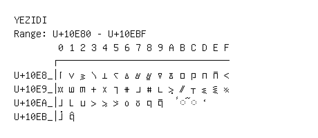

# Yezidi

**Range:** `U+10E80` - `U+10EBF`

[← Back to Index](../README.md)

```text
        0 1 2 3 4 5 6 7 8 9 A B C D E F
       ┌───────────────────────────────
U+10E8_│𐺀 𐺁 𐺂 𐺃 𐺄 𐺅 𐺆 𐺇 𐺈 𐺉 𐺊 𐺋 𐺌 𐺍 𐺎 𐺏
U+10E9_│𐺐 𐺑 𐺒 𐺓 𐺔 𐺕 𐺖 𐺗 𐺘 𐺙 𐺚 𐺛 𐺜 𐺝 𐺞 𐺟
U+10EA_│𐺠 𐺡 𐺢 𐺣 𐺤 𐺥 𐺦 𐺧 𐺨 𐺩   ◌𐺫 ◌𐺬 𐺭
U+10EB_│𐺰 𐺱
```

## Visual Fallback Reference
If your system lacks the required fonts to render these characters properly, use the image below as a visual guide.


