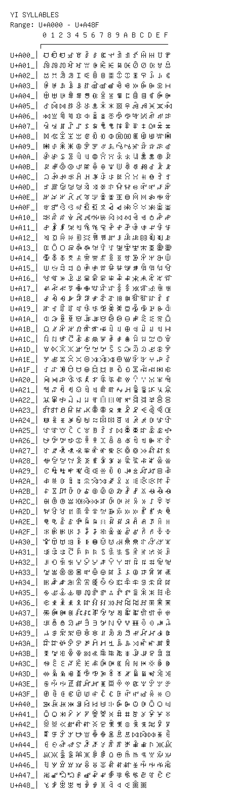

# Yi Syllables

**Range:** `U+A000` - `U+A48F`

[← Back to Index](../README.md)

```text
        0 1 2 3 4 5 6 7 8 9 A B C D E F
       ┌───────────────────────────────
U+A00_│ꀀꀁꀂꀃꀄꀅꀆꀇꀈꀉꀊꀋꀌꀍꀎꀏ
U+A01_│ꀐꀑꀒꀓꀔꀕꀖꀗꀘꀙꀚꀛꀜꀝꀞꀟ
U+A02_│ꀠꀡꀢꀣꀤꀥꀦꀧꀨꀩꀪꀫꀬꀭꀮꀯ
U+A03_│ꀰꀱꀲꀳꀴꀵꀶꀷꀸꀹꀺꀻꀼꀽꀾꀿ
U+A04_│ꁀꁁꁂꁃꁄꁅꁆꁇꁈꁉꁊꁋꁌꁍꁎꁏ
U+A05_│ꁐꁑꁒꁓꁔꁕꁖꁗꁘꁙꁚꁛꁜꁝꁞꁟ
U+A06_│ꁠꁡꁢꁣꁤꁥꁦꁧꁨꁩꁪꁫꁬꁭꁮꁯ
U+A07_│ꁰꁱꁲꁳꁴꁵꁶꁷꁸꁹꁺꁻꁼꁽꁾꁿ
U+A08_│ꂀꂁꂂꂃꂄꂅꂆꂇꂈꂉꂊꂋꂌꂍꂎꂏ
U+A09_│ꂐꂑꂒꂓꂔꂕꂖꂗꂘꂙꂚꂛꂜꂝꂞꂟ
U+A0A_│ꂠꂡꂢꂣꂤꂥꂦꂧꂨꂩꂪꂫꂬꂭꂮꂯ
U+A0B_│ꂰꂱꂲꂳꂴꂵꂶꂷꂸꂹꂺꂻꂼꂽꂾꂿ
U+A0C_│ꃀꃁꃂꃃꃄꃅꃆꃇꃈꃉꃊꃋꃌꃍꃎꃏ
U+A0D_│ꃐꃑꃒꃓꃔꃕꃖꃗꃘꃙꃚꃛꃜꃝꃞꃟ
U+A0E_│ꃠꃡꃢꃣꃤꃥꃦꃧꃨꃩꃪꃫꃬꃭꃮꃯ
U+A0F_│ꃰꃱꃲꃳꃴꃵꃶꃷꃸꃹꃺꃻꃼꃽꃾꃿ
U+A10_│ꄀꄁꄂꄃꄄꄅꄆꄇꄈꄉꄊꄋꄌꄍꄎꄏ
U+A11_│ꄐꄑꄒꄓꄔꄕꄖꄗꄘꄙꄚꄛꄜꄝꄞꄟ
U+A12_│ꄠꄡꄢꄣꄤꄥꄦꄧꄨꄩꄪꄫꄬꄭꄮꄯ
U+A13_│ꄰꄱꄲꄳꄴꄵꄶꄷꄸꄹꄺꄻꄼꄽꄾꄿ
U+A14_│ꅀꅁꅂꅃꅄꅅꅆꅇꅈꅉꅊꅋꅌꅍꅎꅏ
U+A15_│ꅐꅑꅒꅓꅔꅕꅖꅗꅘꅙꅚꅛꅜꅝꅞꅟ
U+A16_│ꅠꅡꅢꅣꅤꅥꅦꅧꅨꅩꅪꅫꅬꅭꅮꅯ
U+A17_│ꅰꅱꅲꅳꅴꅵꅶꅷꅸꅹꅺꅻꅼꅽꅾꅿ
U+A18_│ꆀꆁꆂꆃꆄꆅꆆꆇꆈꆉꆊꆋꆌꆍꆎꆏ
U+A19_│ꆐꆑꆒꆓꆔꆕꆖꆗꆘꆙꆚꆛꆜꆝꆞꆟ
U+A1A_│ꆠꆡꆢꆣꆤꆥꆦꆧꆨꆩꆪꆫꆬꆭꆮꆯ
U+A1B_│ꆰꆱꆲꆳꆴꆵꆶꆷꆸꆹꆺꆻꆼꆽꆾꆿ
U+A1C_│ꇀꇁꇂꇃꇄꇅꇆꇇꇈꇉꇊꇋꇌꇍꇎꇏ
U+A1D_│ꇐꇑꇒꇓꇔꇕꇖꇗꇘꇙꇚꇛꇜꇝꇞꇟ
U+A1E_│ꇠꇡꇢꇣꇤꇥꇦꇧꇨꇩꇪꇫꇬꇭꇮꇯ
U+A1F_│ꇰꇱꇲꇳꇴꇵꇶꇷꇸꇹꇺꇻꇼꇽꇾꇿ
U+A20_│ꈀꈁꈂꈃꈄꈅꈆꈇꈈꈉꈊꈋꈌꈍꈎꈏ
U+A21_│ꈐꈑꈒꈓꈔꈕꈖꈗꈘꈙꈚꈛꈜꈝꈞꈟ
U+A22_│ꈠꈡꈢꈣꈤꈥꈦꈧꈨꈩꈪꈫꈬꈭꈮꈯ
U+A23_│ꈰꈱꈲꈳꈴꈵꈶꈷꈸꈹꈺꈻꈼꈽꈾꈿ
U+A24_│ꉀꉁꉂꉃꉄꉅꉆꉇꉈꉉꉊꉋꉌꉍꉎꉏ
U+A25_│ꉐꉑꉒꉓꉔꉕꉖꉗꉘꉙꉚꉛꉜꉝꉞꉟ
U+A26_│ꉠꉡꉢꉣꉤꉥꉦꉧꉨꉩꉪꉫꉬꉭꉮꉯ
U+A27_│ꉰꉱꉲꉳꉴꉵꉶꉷꉸꉹꉺꉻꉼꉽꉾꉿ
U+A28_│ꊀꊁꊂꊃꊄꊅꊆꊇꊈꊉꊊꊋꊌꊍꊎꊏ
U+A29_│ꊐꊑꊒꊓꊔꊕꊖꊗꊘꊙꊚꊛꊜꊝꊞꊟ
U+A2A_│ꊠꊡꊢꊣꊤꊥꊦꊧꊨꊩꊪꊫꊬꊭꊮꊯ
U+A2B_│ꊰꊱꊲꊳꊴꊵꊶꊷꊸꊹꊺꊻꊼꊽꊾꊿ
U+A2C_│ꋀꋁꋂꋃꋄꋅꋆꋇꋈꋉꋊꋋꋌꋍꋎꋏ
U+A2D_│ꋐꋑꋒꋓꋔꋕꋖꋗꋘꋙꋚꋛꋜꋝꋞꋟ
U+A2E_│ꋠꋡꋢꋣꋤꋥꋦꋧꋨꋩꋪꋫꋬꋭꋮꋯ
U+A2F_│ꋰꋱꋲꋳꋴꋵꋶꋷꋸꋹꋺꋻꋼꋽꋾꋿ
U+A30_│ꌀꌁꌂꌃꌄꌅꌆꌇꌈꌉꌊꌋꌌꌍꌎꌏ
U+A31_│ꌐꌑꌒꌓꌔꌕꌖꌗꌘꌙꌚꌛꌜꌝꌞꌟ
U+A32_│ꌠꌡꌢꌣꌤꌥꌦꌧꌨꌩꌪꌫꌬꌭꌮꌯ
U+A33_│ꌰꌱꌲꌳꌴꌵꌶꌷꌸꌹꌺꌻꌼꌽꌾꌿ
U+A34_│ꍀꍁꍂꍃꍄꍅꍆꍇꍈꍉꍊꍋꍌꍍꍎꍏ
U+A35_│ꍐꍑꍒꍓꍔꍕꍖꍗꍘꍙꍚꍛꍜꍝꍞꍟ
U+A36_│ꍠꍡꍢꍣꍤꍥꍦꍧꍨꍩꍪꍫꍬꍭꍮꍯ
U+A37_│ꍰꍱꍲꍳꍴꍵꍶꍷꍸꍹꍺꍻꍼꍽꍾꍿ
U+A38_│ꎀꎁꎂꎃꎄꎅꎆꎇꎈꎉꎊꎋꎌꎍꎎꎏ
U+A39_│ꎐꎑꎒꎓꎔꎕꎖꎗꎘꎙꎚꎛꎜꎝꎞꎟ
U+A3A_│ꎠꎡꎢꎣꎤꎥꎦꎧꎨꎩꎪꎫꎬꎭꎮꎯ
U+A3B_│ꎰꎱꎲꎳꎴꎵꎶꎷꎸꎹꎺꎻꎼꎽꎾꎿ
U+A3C_│ꏀꏁꏂꏃꏄꏅꏆꏇꏈꏉꏊꏋꏌꏍꏎꏏ
U+A3D_│ꏐꏑꏒꏓꏔꏕꏖꏗꏘꏙꏚꏛꏜꏝꏞꏟ
U+A3E_│ꏠꏡꏢꏣꏤꏥꏦꏧꏨꏩꏪꏫꏬꏭꏮꏯ
U+A3F_│ꏰꏱꏲꏳꏴꏵꏶꏷꏸꏹꏺꏻꏼꏽꏾꏿ
U+A40_│ꐀꐁꐂꐃꐄꐅꐆꐇꐈꐉꐊꐋꐌꐍꐎꐏ
U+A41_│ꐐꐑꐒꐓꐔꐕꐖꐗꐘꐙꐚꐛꐜꐝꐞꐟ
U+A42_│ꐠꐡꐢꐣꐤꐥꐦꐧꐨꐩꐪꐫꐬꐭꐮꐯ
U+A43_│ꐰꐱꐲꐳꐴꐵꐶꐷꐸꐹꐺꐻꐼꐽꐾꐿ
U+A44_│ꑀꑁꑂꑃꑄꑅꑆꑇꑈꑉꑊꑋꑌꑍꑎꑏ
U+A45_│ꑐꑑꑒꑓꑔꑕꑖꑗꑘꑙꑚꑛꑜꑝꑞꑟ
U+A46_│ꑠꑡꑢꑣꑤꑥꑦꑧꑨꑩꑪꑫꑬꑭꑮꑯ
U+A47_│ꑰꑱꑲꑳꑴꑵꑶꑷꑸꑹꑺꑻꑼꑽꑾꑿ
U+A48_│ꒀꒁꒂꒃꒄꒅꒆꒇꒈꒉꒊꒋꒌ
```

## Visual Fallback Reference
If your system lacks the required fonts to render these characters properly, use the image below as a visual guide.


