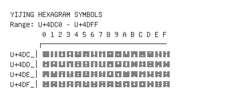

# Yijing Hexagram Symbols

**Range:** `U+4DC0` - `U+4DFF`

[← Back to Index](../README.md)

```text
        0 1 2 3 4 5 6 7 8 9 A B C D E F
       ┌───────────────────────────────
U+4DC_│䷀ ䷁ ䷂ ䷃ ䷄ ䷅ ䷆ ䷇ ䷈ ䷉ ䷊ ䷋ ䷌ ䷍ ䷎ ䷏
U+4DD_│䷐ ䷑ ䷒ ䷓ ䷔ ䷕ ䷖ ䷗ ䷘ ䷙ ䷚ ䷛ ䷜ ䷝ ䷞ ䷟
U+4DE_│䷠ ䷡ ䷢ ䷣ ䷤ ䷥ ䷦ ䷧ ䷨ ䷩ ䷪ ䷫ ䷬ ䷭ ䷮ ䷯
U+4DF_│䷰ ䷱ ䷲ ䷳ ䷴ ䷵ ䷶ ䷷ ䷸ ䷹ ䷺ ䷻ ䷼ ䷽ ䷾ ䷿
```

## Visual Fallback Reference
If your system lacks the required fonts to render these characters properly, use the image below as a visual guide.


