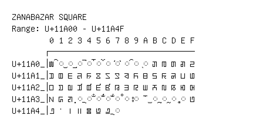

# Zanabazar Square

**Range:** `U+11A00` - `U+11A4F`

[← Back to Index](../README.md)

```text
        0 1 2 3 4 5 6 7 8 9 A B C D E F
       ┌───────────────────────────────
U+11A0_│𑨀 ◌𑨁 ◌𑨂 ◌𑨃 ◌𑨄 ◌𑨅 ◌𑨆 ◌𑨇 ◌𑨈 ◌𑨉 ◌𑨊 𑨋 𑨌 𑨍 𑨎 𑨏
U+11A1_│𑨐 𑨑 𑨒 𑨓 𑨔 𑨕 𑨖 𑨗 𑨘 𑨙 𑨚 𑨛 𑨜 𑨝 𑨞 𑨟
U+11A2_│𑨠 𑨡 𑨢 𑨣 𑨤 𑨥 𑨦 𑨧 𑨨 𑨩 𑨪 𑨫 𑨬 𑨭 𑨮 𑨯
U+11A3_│𑨰 𑨱 𑨲 ◌𑨳 ◌𑨴 ◌𑨵 ◌𑨶 ◌𑨷 ◌𑨸 ◌𑨹 𑨺 ◌𑨻 ◌𑨼 ◌𑨽 ◌𑨾 𑨿
U+11A4_│𑩀 𑩁 𑩂 𑩃 𑩄 𑩅 𑩆 ◌𑩇
```

## Visual Fallback Reference
If your system lacks the required fonts to render these characters properly, use the image below as a visual guide.


