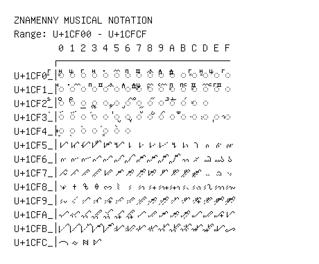

# Znamenny Musical Notation

**Range:** `U+1CF00` - `U+1CFCF`

[← Back to Index](../README.md)

```text
        0 1 2 3 4 5 6 7 8 9 A B C D E F
       ┌───────────────────────────────
U+1CF0_│◌𜼀 ◌𜼁 ◌𜼂 ◌𜼃 ◌𜼄 ◌𜼅 ◌𜼆 ◌𜼇 ◌𜼈 ◌𜼉 ◌𜼊 ◌𜼋 ◌𜼌 ◌𜼍 ◌𜼎 ◌𜼏
U+1CF1_│◌𜼐 ◌𜼑 ◌𜼒 ◌𜼓 ◌𜼔 ◌𜼕 ◌𜼖 ◌𜼗 ◌𜼘 ◌𜼙 ◌𜼚 ◌𜼛 ◌𜼜 ◌𜼝 ◌𜼞 ◌𜼟
U+1CF2_│◌𜼠 ◌𜼡 ◌𜼢 ◌𜼣 ◌𜼤 ◌𜼥 ◌𜼦 ◌𜼧 ◌𜼨 ◌𜼩 ◌𜼪 ◌𜼫 ◌𜼬 ◌𜼭
U+1CF3_│◌𜼰 ◌𜼱 ◌𜼲 ◌𜼳 ◌𜼴 ◌𜼵 ◌𜼶 ◌𜼷 ◌𜼸 ◌𜼹 ◌𜼺 ◌𜼻 ◌𜼼 ◌𜼽 ◌𜼾 ◌𜼿
U+1CF4_│◌𜽀 ◌𜽁 ◌𜽂 ◌𜽃 ◌𜽄 ◌𜽅 ◌𜽆
U+1CF5_│𜽐 𜽑 𜽒 𜽓 𜽔 𜽕 𜽖 𜽗 𜽘 𜽙 𜽚 𜽛 𜽜 𜽝 𜽞 𜽟
U+1CF6_│𜽠 𜽡 𜽢 𜽣 𜽤 𜽥 𜽦 𜽧 𜽨 𜽩 𜽪 𜽫 𜽬 𜽭 𜽮 𜽯
U+1CF7_│𜽰 𜽱 𜽲 𜽳 𜽴 𜽵 𜽶 𜽷 𜽸 𜽹 𜽺 𜽻 𜽼 𜽽 𜽾 𜽿
U+1CF8_│𜾀 𜾁 𜾂 𜾃 𜾄 𜾅 𜾆 𜾇 𜾈 𜾉 𜾊 𜾋 𜾌 𜾍 𜾎 𜾏
U+1CF9_│𜾐 𜾑 𜾒 𜾓 𜾔 𜾕 𜾖 𜾗 𜾘 𜾙 𜾚 𜾛 𜾜 𜾝 𜾞 𜾟
U+1CFA_│𜾠 𜾡 𜾢 𜾣 𜾤 𜾥 𜾦 𜾧 𜾨 𜾩 𜾪 𜾫 𜾬 𜾭 𜾮 𜾯
U+1CFB_│𜾰 𜾱 𜾲 𜾳 𜾴 𜾵 𜾶 𜾷 𜾸 𜾹 𜾺 𜾻 𜾼 𜾽 𜾾 𜾿
U+1CFC_│𜿀 𜿁 𜿂 𜿃
```

## Visual Fallback Reference
If your system lacks the required fonts to render these characters properly, use the image below as a visual guide.


